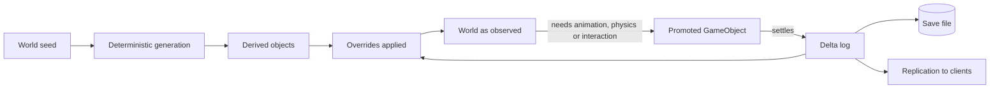
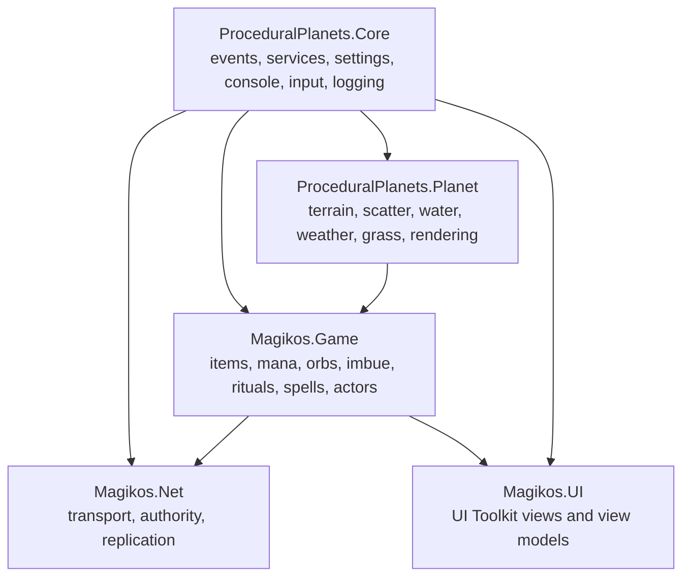
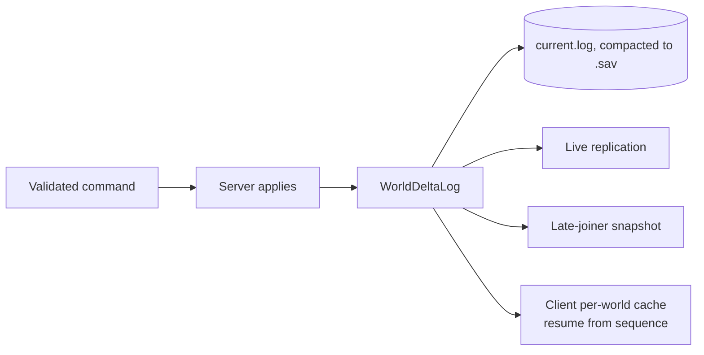

# Magikos — Game Architecture and Milestone Plan

**Date:** 2026-08-20. Open decisions resolved 2026-08-21. `docs/phases/` swept and folded 2026-08-21.
**Status:** Architecture **accepted** — all seven open decisions ruled (§13), M0 unblocked. Gameplay contract (§0) is **proposed and unruled**, including one open design question that shapes M5 onward.
**Supersedes:** the netcode decision in `docs/phases/00-architecture.md:57` and `docs/phases/13-phase14-multiplayer.md` (Mirror → NGO, ADR-1), plus the reversals listed in §2. Extends `docs/design/2026-08-12-next-roadmap.md` with the game layer above the harvest slice.
**Merges:** `docs/Magikos_AI_Project_Context.docx` (the ChatGPT design consolidation, 2026-08-18) with the current repository and the existing docs of record — including `docs/PROJECT_PLAN.md` and the seventeen `docs/phases/` chapters, which the first draft of this document did **not** read. See §17.

---

## 0. The gameplay contract

**Status: Proposed.** Everything else in this document is architecture — how the game is built. This section is the game itself, and it is the one part nobody has ruled on. The Magikos document asked for it first ("write a one-page gameplay contract") and the first three drafts of this document skipped straight to systems. A system can be correct and still not be a game, so this comes before the architecture, not after it.

It is written to be **falsifiable**. The claims at the end are the ones a playtest can prove wrong.

### Player fantasy

> You are a wizard homesteading a wild planet. You do not learn magic from a teacher — you take it apart. Everything in the world will accept an orb, and what happens next is yours to find out.

The Valheim skeleton is deliberate: go out, gather, come back, improve the place you live, go further next time. What replaces Valheim's combat-and-boss spine is **experimentation** — the loop's tension comes from what you are willing to try, not from what is trying to kill you.

### The 10-minute loop — moment to moment

Walk out from the workshop. Chop, mine, pick. Wood and stone every time; **roughly one node in seven pays a mana orb** (§11.2). Cast small utility magic while you work — a light, a lift, a growth push on a sapling — and watch the bank drain, because it refills slowly.

Three pressures run at once, and none of them is a health bar:

- **Mana** is finite and regenerates on a clock. Casting now means not casting in a minute.
- **The bag grid** is finite and shaped. A shield is 4×4. What you carry out determines what you can carry back.
- **Overflow** tempts you. Going over capacity glows, buffs your movement and regeneration, and leaks into the world around you — so there is a live reason to overfill and a live reason not to.

### The 1-hour loop — a block of play

Leave with an intention: a school orb you lack, a material a recipe named, a place you saw and did not reach. Harvest toward it. **Try one thing you have not tried** — push an orb into something and find out. Come home, run a ritual: reallocation is instant enough to use casually (1–2 s), conversion and upgrade are slow enough to plan around (30–60 s+). Bank one upgrade — capacity, generation, bag rows, a recipe you now understand. Extend the workshop so the next hour starts further along.

### The session goal — why you stop satisfied

**One capability you did not have when you sat down.** A school you can now convert into. A ritual you can now run. A portal to somewhere that used to be a walk. A combination that worked and that nobody told you about.

Not "I killed the thing." Not "I filled a bar."

### Long-term progression — 40 hours

The arc is from *casting* to *composing*. Early you spend orbs on capacity because you need headroom. Mid-game you spend them on schools and start reading combinations rather than guessing. Late you have a workshop, a portal network, a grimoire you assembled, and enough Magic Knowledge that the game stops warning you and starts letting you.

The intended peak is the **earned overpowered moment** — a combination that is obviously too strong, that you found by understanding the system rather than by following a quest marker. The design permits it on purpose (the Magikos pillar "emergent power"). It should feel like getting away with something.

### Multiplayer value — why 2–4 beats 1

Not more damage. **Fewer bottlenecks and a shared workshop.**

- **Rituals reward contribution** on a sub-linear curve, so a second pair of hands is a large speedup and an eighth is a small one. That is why 2–4 is optimal and 8 is the ceiling.
- **Overflow spills onto allies** — standing near an overfilled wizard is a buff, so overfilling becomes a group tactic.
- **Division of labour is real** because the axes are separate: Magic Knowledge and crafting skill progress independently, so one player can specialise in research while another supplies materials.
- **The world persists on the host** (§7.1), so it is *their* world you are all improving. Coming back to a friend's planet is the retention hook.

### What this game is not

Not a combat game with magic bolted on. Not a punishing survival sim — the "low-friction failure" pillar means scarcity and overload create risk, not hunger meters and durability decay (ADR-9). Not a fixed spell list: if the design ever ships a menu of N authored spells and no way to combine them, the differentiator is gone.

### The open question this contract cannot answer

**Where does threat come from in the first ten minutes?** Valheim answers with things that bite. This contract answers with mana scarcity, bag pressure and overload risk — three *resource* tensions and no *danger* tension. That may be enough for a builder-experimenter audience and thin for everyone else.

Three ways out, and this is Bryan's call, not mine:

1. **Overload is the danger.** Lean hard on catastrophic imbue results (§11.3) so experimentation itself is the risk. Cheapest — it needs no new system — and most on-theme.
2. **Bring creatures forward.** Currently deferred past M6. Moving basic wildlife and a hostile earlier gives the classic answer at the cost of combat, AI and health, which is three unbuilt systems.
3. **Environmental threat.** Weather and night as real hazards. Cheap to reach — the weather grid exists (§7.1.3) — and it is the trigger that would force the CPU weather port.

My recommendation is **1 now, 3 next, 2 when the AI spine exists** — but the loop should be felt before that is settled.

### Falsifiable claims

If a playtest contradicts one of these, the design is wrong, not the player.

| # | Claim | What failure looks like |
| --- | --- | --- |
| C1 | Harvesting holds attention for ten minutes because it pays a magic dividend | Testers chop twenty trees and describe it as chores. Drop rate or drop feedback is wrong. |
| C2 | Imbuing is the thing players tell their friends about | The first thing a new player reports is not an imbue result. The differentiator is not landing. |
| C3 | Two players feel the ritual speedup | Neither can tell whether the second contributor helped. Cooperative magic is decoration; steepen the curve. |
| C4 | The bag grid creates decisions | Auto-place always succeeds and nobody ever rotates an item. The grid is theatre — ship a list instead. |
| C5 | Mana scarcity changes behaviour | Players never hit empty. The bank is decoration; cut capacity or raise costs. |
| C6 | Overflow tempts | Nobody deliberately overfills. The buff is too weak or too invisible. |

C1, C4 and C5 are testable at **M2**, before any magic exists, by instrumenting the harvest loop. C2, C3 and C6 need **M5–M6**. None of them needs content breadth to answer, which is the point of proving the slice before building the game.

---

## 1. What this document is

This document defines the game that sits on top of the ProceduralPlanets substrate, and the architecture that carries it to 8-player co-op.

It merges three sources:

1. **The Magikos context document** (`docs/Magikos_AI_Project_Context.docx`). It supplies the systemic-magic identity: mana banks, orbs, universal imbuing, rituals, the Bag of Holding, and the multiplayer constraint.
2. **The repository as it stands at HEAD.** Three parallel surveys read the gameplay layer, the core framework, and every design doc of record. Findings are cited by `file:line`.
3. **The existing docs of record** in `docs/design/`, `plans/`, `.agent-memory/`, and `CLAUDE.md`.

The Magikos document was written as if the project were greenfield. It is not. It is a two-year planet simulation with a mature framework, a shipped character controller, and one working gameplay loop. Section 2 reconciles the two.

### Precedence

1. Bryan's explicit instructions.
2. `CLAUDE.md` project rules.
3. Decisions already recorded in `plans/` and `docs/design/` and marked "do not re-litigate".
4. This document.
5. The Magikos context document.

Where this document contradicts the Magikos context document, this document wins, and section 2 records why.

### Requirement labels

| Label | Meaning |
| --- | --- |
| **Established** | Bryan stated it, or it is shipped code, or a doc of record settled it. |
| **Decided here** | This document makes the call. It resolves a contradiction or an open question. Reversible, but re-open it deliberately. |
| **Ruled 2026-08-21** | Bryan answered an open decision after reading the first draft. Same weight as Established. |
| **Deferred** | Real requirement, no design yet, no milestone yet. |
| **Dropped** | In the Magikos document, not in this plan. Reason given. |

---

## 2. Reconciliation: the Magikos document against the repository

The Magikos document's own instruction was to "inventory actual repository state before assuming every discussed feature is production-ready". This is that inventory. Each row is a place where the document and the repository disagree.

| Magikos document says | The repository actually has | Resolution |
| --- | --- | --- |
| "UI Toolkit direction for Magikos" is **Established**. An MDI window framework "has been developed". | **Zero** `.uxml` and **zero** `.uss` files. No `UnityEngine.UIElements` reference anywhere. Game UI is a custom SDF text renderer drawn through a `CommandBuffer` (`Assets/Scripts/Core/Text/SDFTextRenderer.cs`) plus five `OnGUI` sites. The MDI framework lives in a different project. | Adopt UI Toolkit for **game** UI. Keep the SDF renderer for the debug console and the loading overlay — they work and they live inside the render loop. **MDI is undecided** (Bryan, 2026-08-21): "may or may not make it to the game — wait until we start working on UI to decide." M3 builds fixed panels; the MDI question opens at M3, not before. See section 10. |
| Character controller: `BaseCharacterController<TContext>`, kinematic Rigidbody, ASM state machine. | A three-layer split already shipped and play-verified: a pure static `CharacterMotor.TryStep` (`Assets/Scripts/Planet/Character/CharacterMotor.cs:18`), a plain `SurfaceCharacterController` driver, and injected `IGravityProvider` / `IGroundingProvider`. **No Rigidbody. No colliders anywhere in the project.** No state machine, by an explicit decision in `plans/001-character-controller-mvp.md`. | Keep the shipped layering. It is stronger than the document's proposal: the motor is planet-agnostic, actor-agnostic and unit-testable. Adopt the document's `IInputProvider` idea — see section 9, where it also becomes the netcode seam. Rigidbody arrives with the collision bubble, and only for dynamic objects. |
| ASM plus context objects is **Established** architecture. | Zero FSM code. `plans/001` ruled: "one behavior, zero transitions"; the harvested `AdaptiveStateMachine<TContext>` is the "Phase-10 graduation backbone". | Both are right, at different times. The ASM lands at a **named trigger**: the second locomotion driver (swim, climb, or flight) or the first NPC, whichever comes first. Not before. Section 9. |
| The first vertical slice runs in "one small test biome/scene". | A whole procedural planet with biomes, water, weather, and ~1M scatter instances. No test-scene infrastructure. | Run the slice on the real planet at a seeded spawn point. Building a test scene would cost more than using what exists, and it would not exercise streaming, which is where the multiplayer risk lives. |
| World structure, "handcrafted vs procedural", is an **Open** decision. | Settled two years ago. The planet is procedural, seed-derived, and streamed. | Not open. The procedural planet is the world. One planet is the whole game map (Bryan, 2026-08-20). |
| Targets are PC and mobile, with WebGL possible. | Compute-shader grass, raymarched volumetric clouds, GPU readbacks, ~1M instances. | **PC, with a console port as a non-blocking goal** (Bryan, 2026-08-20). Mobile and WebGL are dropped. The practical cost is small and paid now: gamepad input and UI safe-area/scale discipline from the first UI milestone. |
| Items are "physicalized rather than abstract counters". Nearly any world object accepts imbued orbs. | Scatter is GPU-indirect-drawn. There are no `GameObject`s, no colliders, and no C# instances for the ~1M props. Identity is a packed `ulong` (`ScatterId`). | This is the single largest collision in the merge, and it has a good answer that the repository has already prototyped. See section 4. |
| "Do not postpone stable IDs." | `ScatterId` exists and is golden-tested. **Nothing else has an ID** — no player, no placed object, no building, no dropped item. | Add an `EntityId` space in M0. `docs/design/2026-08-17-save-system.md` already ruled that explicit objects "cannot borrow `ScatterId`". |
| Multiplayer, max 8, is **Established**. No networking stack chosen. | Zero networking code. `com.unity.multiplayer.center` in the manifest is an editor wizard, not a runtime dependency. | Choose the stack now (ADR-1) and prove a two-player spine at M1. Bryan ruled multiplayer a hard constraint that shapes architecture from day one. |
| The slice needs "automated tests for grid placement, mana accounting, orb add/remove, effect resolution, serialization round-trip". | `CLAUDE.md`: "No test framework is being added near-term. Don't propose one." But 78 EditMode tests exist and gameplay already uses them — `HarvestServiceTests`, `ScatterHarvestStoreTests`, `ScatterPickMathTests`, `CharacterMotorTests`. | The rule forbids adding a **new framework**. The existing UTF EditMode suite is already in the manifest and already used for gameplay logic. Bryan, 2026-08-21: "I am okay with tests if they speed up development and prevent regression." Working rule: **a test must earn its place by preventing a regression or replacing a slow play-test loop.** Pure domain logic qualifies — grid placement, mana accounting, orb add/remove, effect resolution, serialization round-trip. Nothing else changes, and no second framework arrives. |
| The MDI framework and character-controller work are "existing architectural investments". | The MDI framework is in another repository. The State Machine project is a WIP skeleton — `.agent-memory/claude/reference_state_machine_project.md` records "harvest PATTERNS not code", its motor is an empty stub, and it is collider-based. | Neither is a drop-in. The harvest-only asset rule applies: lift patterns, refit to this architecture. |
| Per-spell mana reserve / Spell Ledger is **Exploratory**, and the document warns against shipping it alongside the global bank. | Nothing exists. | Resolved in ADR-3: one bank, with reservations. No second resource pool. |
| Durability "has been considered but is not established". | Nothing exists. | **Dropped** (Bryan, 2026-08-21). It fights the "low-friction failure" pillar and adds an authority-sensitive per-item counter to every replicated item. Tool quality still matters through `ToolTier`. |

### Reversals against `docs/phases/` (2026-04-25), the original project plan

The seventeen phase chapters indexed by `docs/PROJECT_PLAN.md` were **not read** when this document was first drafted. A sweep on 2026-08-21 found that most of what follows was reached independently four months earlier — §17 lists the corroborations. It also found six places where this document reverses a founding decision. Each reversal stands; each is recorded here so it is a decision rather than an accident.

| # | `docs/phases/` decided | This document decides | Why the reversal stands |
| --- | --- | --- | --- |
| R1 | **Mirror** for netcode — `00-architecture.md:57`, `13-phase14-multiplayer.md:2,5` | **Netcode for GameObjects** (ADR-1) | Mirror is third-party runtime C# in `Assets/`, which E11 forbids outright. Bryan's Q1 ruling exempts *registry* packages only. The rule post-dates the phase docs. |
| R2 | **"No singletons, no static god-classes"** — `00-code-architecture.md:6` | Statics survive, with "no gameplay state lives in a static" (§7.6) | The five statics shipped anyway and are load-bearing. The narrower rule is enforceable and protects what actually matters under multiplayer. But this **is** a reversal of a founding principle, not a clarification of it. |
| R3 | **Per-chunk delta save files** — `00-architecture.md:66`, `02-phase3-foundation.md:26` | One append-only sequenced log (§8) | The log doubles as the wire format, the late-join snapshot and the client cache (ADR-2, ADR-13) — four consumers, one serializer. §7.5 still buckets *replication* by cell address, so the spatial idea survives; only the on-disk layout reverses. Consequence: `ChunkCoord` loses its intended consumer (B17). |
| R4 | **Client prediction for world-state modifications** — `13-phase14-multiplayer.md:14` | Prediction for movement only; everything else round-trips (§7.4) | At 2–8 friends on co-op latency, a rollback system for chest-opening is not worth its complexity. Narrowing, deliberately. |
| R5 | **Stack-list inventory behind `IInventoryProvider`** — `00-code-architecture.md:59`, `10-phase11-resources.md:5-7` | A footprint grid, `GridInventory`, no interface (§11.4) | The Bag of Holding is an Established requirement (E9) and is not a stack list. The dropped abstraction is worth noting: if a second inventory shape ever appears (a chest, a cart), reintroduce the interface then, not now. |
| R6 | **Play Mode integration tests and performance tests** — `00-cross-cutting.md:187-197` | EditMode only, and only where a test earns its place (D15, §16) | Bryan's Q7 ruling. But M1's definition of done is a two-process byte-identical-log comparison, which EditMode cannot host — see §15 M1, which now names how that is verified instead. |

### What the Magikos document gets right and this plan takes wholesale

- The systemic-magic identity. Composition over a list of scripted exceptions.
- Universal imbuing as the differentiator, with a common contract instead of a magic subclass per object.
- Capability interfaces over deep inheritance.
- Definition/instance separation (`OrbDefinition` vs `OrbInstance`).
- Stable IDs and save versioning from the beginning.
- The Bag of Holding as a 2D grid with footprints and rotation, and no weight limit.
- Cooperative rituals: contribution reduces cost and time.
- Overflow as visible feedback with small benefits, including to nearby allies.
- "Do not let UI windows own authoritative game state."
- "Do not require DOTS/ECS unless profiling demonstrates a need."
- The orb-removal edge case is a real hole and it must have a deterministic policy. Answered in section 11.4.

---

## 3. Requirements ledger

### Established

| # | Requirement | Source |
| --- | --- | --- |
| E1 | Third-person fantasy RPG where the player is a wizard. Valheim-inspired loop. | `project_game_vision.md` |
| E2 | High magic with many spells is the defining feature, not a subsystem. | `project_game_vision.md` |
| E3 | Friends co-op, maximum 8 players, 2–4 optimal. Hard architectural constraint from day one. | Magikos doc; Bryan 2026-08-20 |
| E3a | **A dedicated server is a future target.** Authority must never depend on the host being a player. The host saves; clients keep a per-world cache to cut transfer. | Bryan 2026-08-21 |
| E4 | PC target. Console port is a goal, not a blocker. Mobile and WebGL dropped. | Bryan 2026-08-20 |
| E5 | One procedural planet is the whole game world. Portals are intra-planet fast travel. | Bryan 2026-08-20 |
| E6 | Player is a mana bank with upgradeable generation. Orbs are the magic currency. | `docs/PROJECT_PLAN.md:4` (2026-04-25), `docs/phases/00-architecture.md:88,91`, `14-phase15-polish.md:44`; restated in the Magikos doc |
| E6a | **Orbs enter the world as drops from harvesting**, rolled from a weighted loot table — "Tree → Wood ×3 (100%), Mana Orb ×1 (15%)". | `docs/phases/00-architecture.md:88,91`, `07-phase8-spawning.md` |
| E7 | Nearly any suitable world object can be imbued. Result depends on object, orb school, tier, count, and context. | Magikos doc |
| E8 | First ritual is reallocation (1–2 s). Conversion and upgrade rituals are slower (30–60 s+). | Magikos doc |
| E9 | Bag of Holding is a 2D grid. Items have footprints and rotate. No weight limit. Orbs expand capacity. | Magikos doc |
| E10 | Schools are not mutually exclusive. Magic is learned by discovery, tomes, experimentation and use. | Magikos doc |
| E11 | Harvest-only asset rule. No third-party runtime C# ships in this repository. | `project_game_vision.md`, `CLAUDE.md` |
| E12 | Every prop is generated geometry, not vendor mesh. Pack meshes are landmark pieces. | `project_all_generated_props.md` |
| E13 | The world is derived from a seed. Persistence is an override layer on top. | `ScatterHarvestStore.cs:6`, `plans/003` |
| E14 | Removal of a scatter instance is enforced at exactly one choke point: `ScatterTileCache.Commit`. | `plans/003` §3 |
| E15 | `ScatterId` is the single identity for derived world props. | `plans/003` §3 |
| E16 | Physics arrives as a streamed per-chunk `MeshCollider` bubble cooked from a fixed, camera-independent LOD. | `docs/design/2026-08-09-collision-strategy.md` |
| E17 | All the `CLAUDE.md` framework rules: SO→DTO settings, services over MonoBehaviours, the init graph, ServiceLocator scoping, Awaitable only, comment doctrine, intent markers. | `CLAUDE.md` |

### Decided here

| # | Decision | Section |
| --- | --- | --- |
| D1 | Netcode for GameObjects. **Server role is separate from local player**, so the same build runs as a listen server today and headless later. | ADR-1 |
| D2 | Replicate the seed and a delta log, not the world. One log format serves save, late-join sync and live replication. | 4, 8, ADR-2 |
| D3 | One mana bank. Maintained spells hold reservations against it. No per-spell pool. | 11.1, ADR-3 |
| D4 | Imbuing writes an override record keyed by `ScatterId` or `EntityId`. Entities promote to `GameObject`s only while they must be interactive. | 4, 11.3, ADR-4 |
| D5 | Imbue effects resolve from the orb **multiset**, not application order. | 11.3 |
| D6 | Game domain code lives in a new `Magikos.Game` assembly and never references planet types. | 5, ADR-5 |
| D7 | UI Toolkit for game UI. SDF renderer keeps the console and loading overlay. | 10, ADR-6 |
| D8 | The ASM lands at the second locomotion driver or the first NPC. | 9, ADR-7 |
| D9 | `IInputProvider` producing an `ActorIntent` struct is the single actor input path: player, AI, network and replay. | 9, ADR-8 |
| D10 | A single `EntityId` space for explicit objects, separate from `ScatterId`. | 6, ADR-11 |
| D11 | No DOTS/ECS. | ADR-12 |
| D12 | Unity-registry packages are dependencies, not harvested vendor source. NGO is allowed. | ADR-1, Bryan 2026-08-21 |
| D13 | Clients keep a **non-authoritative per-world delta cache** and resume from a sequence number on rejoin. | 8.3, ADR-13, Bryan 2026-08-21 |
| D14 | Bindings move to a `.inputactions` asset. | 10.4, Bryan 2026-08-21 |
| D15 | A test earns its place by preventing a regression or replacing a slow play-test loop. No new framework. | 2, Bryan 2026-08-21 |

### Deferred

Combat and health. Creature AI and ecology. Crafting, cooking, potions. Building and structure placement. Quests, dialogue, factions, towns. Mounts, taming, carts. Portals. Flight, sailing, swimming, fishing, gardening. Mining and ore. Day/night gameplay rules. Resource regrowth. Death and respawn. Audio. Animation.

Each is real. None has a design *in this document*. **Eight of them do have a design in `docs/phases/`**, which the first draft hid behind one-word deferrals. Listed so the prior work is found rather than redone:

| Deferred item | Where it is already specified | The part worth not losing |
| --- | --- | --- |
| Building | `11-phase12-building.md:20-26` | **Structural integrity**, Valheim-style: support propagates from grounded foundations, weakens with distance, pieces beyond range collapse; wood < stone < metal; pillars reset the distance. A stated pillar in `PROJECT_PLAN.md:4` and designed nowhere else. |
| Resource regrowth | `00-architecture.md:82,84`, `07-phase8-spawning.md:5` | Respawn timer per entity, "or never, player choice". **Schema impact:** the delta record needs a time field, which is an M0 decision, not a later one. |
| Creature AI | `07-phase8-spawning.md:57-60` | Wildlife are harvestable `WorldEntity`s with loot tables (food/hide, chance of orbs), and must **align to surface normal and spherical gravity** — which is why `AiInput` reuses `CharacterMotor` (§9.2). |
| Combat | `14-phase15-polish.md:50-56` | **Base defense** — enemies attack player structures. The co-op pressure mechanic that makes building matter. |
| Sailing | `14-phase15-polish.md:34-41` | Raft → karve → longship, buoyancy, wind direction from the weather system affects heading, walkable deck, boat inventory, boat persists as an entity. On one planet with oceans between continents (E5), this is the inter-continental travel answer. |
| Portals / fast travel | `14-phase15-polish.md:28-32` | Teleport network between discovered locations, **plus map UI, waypoint/beacon placement, and a compass HUD**. Navigation is a real M3-adjacent UI requirement that §10 does not cover. |
| Spell discovery | `14-phase15-polish.md:47`, `10-phase11-resources.md:27` | Spells found in **caves, ruins and rare drops** — a world-exploration channel, not just station research. Depends on §6.5 and on loot tables. |
| Stamina | `09-phase10-character.md:16` | Sprint/jump cost. §11.1's overflow buff already grants "stamina regeneration" — a buff on a system that does not exist. Either build it with the buff or reword the buff. |

### Dropped

| Dropped | Reason |
| --- | --- |
| Mobile and WebGL targets | Bryan, 2026-08-20. The renderer is PC-class and the shipped work assumes it. |
| Durability | Ruled out by Bryan, 2026-08-21. Fights the low-friction-failure pillar; adds a replicated mutable counter to every item. `ToolTier` still differentiates tools. |
| Per-spell mana reserves as an independent pool | ADR-3 resolves it into reservations against one bank. |
| A dedicated test scene for the vertical slice | The real planet is cheaper and exercises streaming. |
| Order-dependent imbue resolution | D5. Deterministic multiset resolution instead. |

---

## 4. The core architectural idea

The Magikos document asks for physicalized objects that can nearly all accept magic. The repository draws roughly a million props with no C# object behind any of them. Reconciling those two is the architecture.

The answer already exists in the repository, in two proven pieces.

**Piece one — the world is a seed plus an exception log.** `ScatterHarvestStore` does not store trees. It stores the handful of trees that are *no longer where the seed says they are*. Everything else regenerates. `SurfaceEditController` does the same for path and scorch stamps.

**Piece two — promotion.** When a tree must animate, `TreeFallSystem` builds a real `GameObject` for it, plays the fall, and hands the result back to the store as a record (`Assets/Scripts/Planet/Scatter/TreeFallSystem.cs:24`). The `GameObject` dies. The record persists.

Generalise both and the whole game fits on the substrate:

> **Every world object is derived from the seed until something happens to it. Then it becomes a record in a delta log. It becomes a `GameObject` only while it must be interactive, animated, or physical, and it demotes back to a record when it stops.**

This yields four object states:

| State | Backing | Cost | Example |
| --- | --- | --- | --- |
| **Derived** | The seed. No memory, no record. | Zero | An untouched tree among a million |
| **Overridden** | A delta record keyed by `ScatterId` | ~40 bytes | A chopped stump; an imbued boulder |
| **Explicit** | A delta record keyed by `EntityId` | ~60 bytes | A dropped log; a placed workbench; an orb on the ground |
| **Promoted** | A live `GameObject` plus its record | Full | The tree currently falling; the chest you have open |

The consequences run through the whole design:

- **Imbuing scales.** Imbuing a boulder writes one record. A million un-imbued boulders cost nothing. There is no `MagicBoulder` class and no per-object component.
- **Multiplayer becomes affordable.** You never replicate the world. You replicate the seed once at join, then the delta log. Eight players on a whole planet is a bandwidth problem the size of the log, not the size of the planet.
- **The save file and the network stream are the same data.** One record format. One serializer. One schema version. A late joiner receives the same bytes a load reads from disk.
- **Determinism becomes a hard requirement**, because every client must derive the identical base world from the seed. Section 7.3.

**Promotion churn needs pooling.** Promoting and demoting `GameObject`s as objects become interactive is precisely the allocation pattern `docs/phases/00-cross-cutting.md:78-97` specified object pools for — "all entity spawning goes through pools (trees, rocks, pickups, particles)". The repository's `ObjectPool` and `IObjectPool<T>` were deleted at `f63ec14` as unreferenced, because their only recorded intent lived in `docs/phases/`, which the dead-code rule does not protect (B18). They are recoverable from git. Reintroduce a pool when the promotion path is real — M4, alongside dropped-item settling — and measure before assuming it is needed.



---

## 5. Layers, assemblies and dependency rules

### Today

Six assemblies. `Core ← Planet ← {Sampling, Editor, Tests}`. No C# namespaces anywhere — every type is global.

Gameplay is currently split without a rule: `InventoryService` sits in `Core/Services/`, `HarvestService` sits in `Planet/Scatter/`. No document states where gameplay code belongs.

### Decided

Add one assembly.



**Rule 1 — the game domain never references planet types.** `Magikos.Game` may reference `ProceduralPlanets.Core` only. It reaches the world through capability interfaces that the planet layer implements and registers.

The repository has already proved this works. `HarvestService` takes five injected delegates and knows nothing about scatter (`Assets/Scripts/Planet/Scatter/HarvestService.cs:11-15`). It is the cleanest seam in the codebase. Formalise it into interfaces as it grows past five:

```csharp
// Magikos.Game — the world as the game layer needs it
public interface IWorldSurface            // already exists as IPlanetSurfaceSampler + IPlanetSurfaceRaycaster
{
    bool TryGetSurfaceRadius(Vector3 worldUnitDirection, out float surfaceRadius);
    bool TryRaycastSurface(Ray worldRay, float maxDistance, out PlanetSurfaceRaycastHit hit);
}

public interface IWorldPropIndex           // query and mutate derived props
{
    bool TryDescribe(ScatterId id, out PropDescriptor descriptor);
    bool TryPick(Ray ray, float reach, float perpendicular, out ScatterId id);
    void Remove(ScatterId id);
}

public interface IWorldDeltaLog            // the one write path for persistent world change
{
    void Append(in WorldDelta delta);
    bool TryGet(ulong key, out WorldDelta delta);
    IReadOnlyList<WorldDelta> Snapshot();
}
```

`IWorldSurface` is not new work. `IPlanetSurfaceSampler` and `IPlanetSurfaceRaycaster` already exist in `Assets/Scripts/Core/Interfaces/IPlanetSurfaceSampler.cs` with exactly these members. `.agent-memory/claude/reference_external_asset_library.md` already recorded that an `ISurfaceQuery` service was a prerequisite for survival and crafting code. It is built.

**Rule 2 — the planet layer supplies adapters, not gameplay.** `ScatterPicker`, `ScatterTileCache` and the surface providers stay in `Planet`. Thin adapters in `Planet` implement the `Magikos.Game` interfaces and register them on the world context.

**Rule 3 — `Magikos.Net` may reference `Game`, never the reverse.** Domain services must run headless with no transport present. This is what keeps single-player fast and tests cheap.

**Rule 4 — `Magikos.UI` may reference `Game`, never the reverse.** No domain type knows a `VisualElement` exists.

**Rule 5 — introduce namespaces in the new assemblies.** `Magikos.Game.Items`, `Magikos.Game.Magic`, and so on. Do not retrofit `Core` and `Planet`; that is churn with no benefit. New code gets the discipline.

### Where the existing gameplay code moves in M0

| Type | Today | Goes to |
| --- | --- | --- |
| `HarvestService`, `ToolTier`, `HarvestYield` | `Planet/Scatter/`, `Core/Services/HarvestTypes.cs` | `Magikos.Game.Harvest` |
| `HarvestInteractor`, `ScatterPicker` | `Planet/Scatter/` | Stay. They are planet adapters. |
| `ScatterHarvestStore` | `Planet/Scatter/` | Folds into the unified delta log (section 8) |
| `InventoryService` | `Core/Services/` | Replaced in M2 by the real inventory in `Magikos.Game.Items` |
| `CharacterMotor`, `SurfaceCharacterController`, `IGravityProvider`, `IGroundingProvider` | `Planet/Character/` | `Magikos.Game.Actors`. None of them reference a planet type. |
| `PlanetCharacterController` | `Planet/Character/` | Stays. It is the planet-specific host. |

---

## 6. Domain model

### 6.1 Identity

Two ID spaces. They never mix.

```csharp
// Existing. Derived props. face | level | x | y | slot packed into a ulong.
// Assets/Scripts/Planet/Scatter/ScatterId.cs — golden-tested, CPU and Burst packers verified equal.
public readonly struct ScatterId { public readonly ulong Value; }

// New in M0. Explicit objects that the seed did not create.
public readonly struct EntityId { public readonly ulong Value; }
```

`docs/design/2026-08-17-save-system.md` already ruled why they cannot be one space: a `ScatterId` encodes a *derived cell address*, and a dropped item has no cell address.

**`EntityId` allocation under multiplayer.** The host owns allocation. The high 16 bits are an owner tag, the low 48 bits are a monotonic counter. A client that predicts a spawn uses a provisional ID in its own tag range and the host's authoritative ID replaces it on confirmation. This is the single most important thing to get right in M0, because every save record and every replicated object depends on it.

`plans/003` left the door open for this: "If a unified handle is ever wanted, reserve a slot *value* meaning 'look this up elsewhere' rather than taking a bit back." That reservation is how a promoted scatter prop gets an `EntityId` while keeping its `ScatterId` lineage.

### 6.2 Definition and instance

Follow the `CLAUDE.md` settings pattern exactly, because it already solves this problem.

| Layer | Form | Example |
| --- | --- | --- |
| Authoring | `ScriptableObject`, editor-only | `ItemDefinition`, `OrbDefinition`, `RitualRecipe` |
| Runtime snapshot | `sealed record` with `static From(SO)` | `ItemDto`, `OrbDto`, `RitualDto` |
| Runtime instance | `struct` or small class, serialized, replicated | `ItemInstance`, `OrbInstance` |

A content catalogue registers as one `IWorldSettingsRegistrar` per domain, exactly as `ScatterLibraryDto` does today. `SceneBootstrap` validates and freezes it before any game service initializes.

**Definitions are addressed by stable string ID, never by asset reference.** A save file and a network packet carry `"orb.fire.t2"`, not a `ScriptableObject` pointer. The Magikos document is right about this and it is cheap to honour from the start.

### 6.3 Capability contracts

The Magikos document asks for capability interfaces over inheritance. On this substrate a capability is usually a property of a *definition*, not of an object, because most objects have no C# instance. So capabilities resolve as a function:

```
capability set = f(archetype, override records)
```

```csharp
public interface ICapabilityResolver
{
    bool Has<TCapability>(in WorldRef target);
    bool TryGet<TCapability>(in WorldRef target, out TCapability capability);
}

// A WorldRef is one of: a ScatterId, an EntityId, or a live promoted actor.
public readonly struct WorldRef
{
    public readonly WorldRefKind Kind;   // Derived, Explicit, Actor
    public readonly ulong Key;
}
```

Capabilities in the first pass: `IImbueTarget`, `IManaStore`, `IHarvestable`, `IStorable`, `ICarryable`, `IInteractable`, `IRitualParticipant`.

This is what stops the subclass explosion the Magikos document warns about. There is no `MagicApple` type. There is an apple archetype that declares `IImbueTarget`, an imbue record against its ID, and an effect table that resolves the pair.

### 6.4 The delta record

One record type serves every persistent world change.

```csharp
public readonly struct WorldDelta
{
    public readonly uint     Sequence;    // host-assigned, monotonic, the ordering authority
    public readonly DeltaKind Kind;
    public readonly ulong    Key;         // a ScatterId or an EntityId, per Kind
    public readonly ushort   PayloadLength;
    // payload follows: fixed-size per Kind
}

public enum DeltaKind : byte
{
    ScatterRemoved = 1,   // a chopped tree
    ScatterState   = 2,   // stump, dug
    SurfaceStamp   = 3,   // path wear, scorch — folds in SurfaceEditController
    EntitySpawned  = 4,   // a dropped log, a placed workbench
    EntityMoved    = 5,
    EntityRemoved  = 6,
    EntityState    = 7,   // imbue records, container contents, ritual progress
    PlayerState    = 8,   // position, mana, bag — one per player
    TerrainDeform  = 9,   // RESERVED, not implemented — see 6.5
}
```

### 6.5 Deformable terrain — reserved, not designed

`docs/phases/00-architecture.md:5` made hybrid marching-cubes terrain a **founding** decision: *"local playable area: marching cubes chunks loaded around the player on the sphere surface — enables caves, terrain deformation, digging."* The whole of `08-phase9-marching-cubes.md` specifies it, `WorldActionType.TerrainDeform` exists in shipped code, and `BiomeType.Cave` exists as an enum value.

The first draft of this document omitted all of it across 1100 lines. That is not a decision to drop it — it is an oversight, and it has one consequence that must be stated rather than left implicit:

> **§7.1.2's determinism argument assumes terrain is not deformable.** Ground height is deterministic *because* the quadtree is fully built to a fixed depth and every leaf's radii are derived from the seed and never change. A player who digs a hole invalidates that: the ground at that direction is no longer a pure function of the seed, and it becomes a delta the log must carry and every client must apply before its ground query agrees.

That is not an argument against digging. It is the specification for adding it: **a terrain deformation is a delta record like any other**, applied on top of derived geometry, exactly as a chopped tree is. The architecture already has the shape; `DeltaKind.TerrainDeform` is reserved above so the schema does not need a version bump when it arrives.

Three things stay unresolved and are **deliberately out of scope** here, because each is a project in itself:

1. Whether the surface stays a heightfield with a deformation overlay, or becomes marching-cubes density in the playable bubble as the phase docs intended. Caves require the latter; digging a pit does not.
2. How a deformed chunk's collision mesh recooks (E16's bubble).
3. Whether `AnalyticGroundSampler` — which by construction cannot see a deformation — remains valid for scatter placement and the water solver over deformed ground. It probably can, with a "deformations do not move props" rule, but that is a decision nobody has made.

Until those are answered, `BiomeType.Cave` and `WorldActionType.TerrainDeform` are **protected infrastructure** (B18), not dead code.

Three hand-rolled JSON files exist today, each written synchronously on every mutation:

| Data | File | Version |
| --- | --- | --- |
| Surface stamps | `surface-edits-{seed}.json` | 1 |
| Stumps and logs | `scatter-harvest-{seed}.json` | 3 |
| Camera poses | PlayerPrefs | v1 (debug only, stays as is) |

M0 collapses the first two into the delta log. `docs/design/2026-08-17-save-system.md` already designed the storage: an append-only `current.log`, size-triggered compaction, an `auto-0..N.sav` ring plus `manual-<name>.sav`, atomic temp-write-and-rename, torn-record checksums, and a 41-byte binary record against roughly 160 bytes of JSON. That design is correct and unbuilt. Its stated build trigger was "persistent dropped items". Multiplayer moves the trigger forward: the log is now also the wire format.

---

## 7. Multiplayer architecture

Bryan ruled that 8-player co-op is a hard constraint that shapes architecture now.

### 7.1 Topology

**A server role, plus zero or one local player per process.** Bryan ruled on 2026-08-21 that a dedicated server is a future target. That one sentence changes the shape of the whole networking layer, so state it as the rule it is:

> **Authority belongs to the server role, never to "the player who happens to be hosting."** A listen server is the server role and a local player in one process. A dedicated server is the server role alone. Nothing in the game layer may ask "am I the host" and mean "am I player one".

| Deployment | Server role | Local player | Owns the save | When |
| --- | --- | --- | --- | --- |
| Single-player | In-process | Yes | This machine | Today, and M0 |
| Listen server | In-process | Yes | The hosting player's machine | M1 |
| Dedicated server | Its own process, headless | **No** | The server | Future, not built |

Practically, that means three things from M1 onward:

1. **No authoritative code runs inside `PlanetCharacterController` or any other player-host MonoBehaviour.** Authority lives in services that a headless process can construct with no camera, no input and no local actor.
2. **No authoritative code may touch a renderer, a camera, a `Shader.SetGlobal*`, or an `AsyncGPUReadback`.** This is the constraint with real teeth — see the risk below.
3. **`IInputProvider` already covers the case.** A dedicated server has remote `NetworkInput` providers and no `LocalPlayerInput`. Nothing else changes. This is the second time ADR-8 pays for itself.

### 7.1.1 Gameplay truth is CPU. Appearance is GPU.

The obvious worry about a headless server is that world derivation runs on the GPU and a server has none. A survey on 2026-08-21 measured it. The worry is mostly unfounded, and the reason is worth stating as a rule rather than a relief.

> **The GPU decides what the world looks like. The CPU decides what is true about it.**

That split already exists, because the CPU needed those answers for grounding, placement and picking years before multiplayer was considered. Six of the seven gameplay facts a server must answer are already CPU-authoritative:

| Gameplay fact | Authority | Entry point | Headless-safe |
| --- | --- | --- | --- |
| Prop existence and identity | CPU Burst | `Scatter/ScatterGatherJob.cs:63` | Yes |
| Water level, is-underwater | CPU managed | `WaterQueryService.cs:51`, `Biomes/WaterBodyMap.cs:459` | Yes |
| Biome at a point | CPU managed + Burst mirror | `ColorGenerator.cs:201`, `Biomes/BiomeLookupData.cs:47` | Yes |
| Chunk meshes (collision source) | CPU Burst | `Surface/PlanetChunkMeshJob.cs:17` | Yes |
| Surface edits (path, scorch) | CPU managed | `Surface/ChunkedSurfaceProvider.cs:998` | Yes |
| Wind, temperature | CPU managed | `WeatherManager.cs:190`, `:362` | Yes |
| Ground height | CPU managed | `Surface/ChunkedSurfaceProvider.cs:288` | Yes — **measured**, see 7.1.2 |
| **Rain, storm, humidity, coverage** | **GPU only** | `Clouds/SphericalWeatherGrid.cs:428` | **No** |

Of eight `AsyncGPUReadback` call sites, seven are grass diagnostics. Weather is the only gameplay value that round-trips the GPU.

Two corrections to earlier drafts of this document, recorded so nobody re-derives them. The biome map does **not** bake through compute — `BiomeMapBaker` runs on the CPU under `Parallel.For` and uploads the result; nothing reads a biome back off the GPU. And `Assets/Resources/GpuPlanetTerrain.compute` has zero references anywhere; it is a dead asset, not a live GPU height path.

**Why not simply run the GPU code on a software GPU.** A software Vulkan implementation (SwiftShader, llvmpipe) does run compute shaders headless, and it is tempting because it keeps one implementation of the math instead of two that can drift — and this codebase has been bitten by exactly that drift twice, per the GPU-authored-scatter doc's own risk section.

It fails on determinism, which is the larger problem. **GPU floating point is not bit-identical across vendors**: transcendental precision, FMA contraction and fast-math defaults all differ. ADR-2 requires every client to derive the same world from the same seed. If gameplay truth came off the GPU, an NVIDIA client and an AMD client would derive marginally different worlds — a biome boundary one cell over, a differing `ScatterId`, a chop that refers to a tree the other player does not have. Silent, rare, and unreproducible on the developer's own machine. A software-GPU server would add a *third* floating-point implementation that must agree with the other two.

This is why lockstep simulations never run on the GPU. It is also why the concern is **not** a future-server concern: it bites at M1, between two friends with different graphics cards.

Software Vulkan stays in the back pocket for anything that is visual-only but still needed headless. It is the wrong tool for gameplay truth.

### 7.1.2 Grounding — measured 2026-08-21, and the concern does not survive

An earlier draft of this document claimed ground height was non-deterministic because `IPlanetSurfaceSampler` resolves to a chunk-mesh path that depends on resident LOD. **That claim was wrong. It is retracted.**

It was wrong twice over. It was inferred from reading `ReleaseCpuDataAfterBake` (`Surface/PlanetChunk.cs:152`) in isolation, without checking what the shipping configuration does — and it contradicted an existing **decision of record**, [2026-08-09-surface-unification.md](2026-08-09-surface-unification.md), which had already established the opposite and had it independently reviewed. That doc's SU1 states plainly that `IPlanetSurfaceSampler.TryGetSurfaceRadius` "is fixed-depth leaf bilinear", and its taxonomy table marks that representation `Camera/LOD? = fixed`, noting that "only *which* rendered leaves are drawn is camera-selected".

So the measurement below **confirms** a settled decision rather than discovering anything. Its real contribution is closing that doc's open follow-up 1 — a land test of the mesh-hit versus silent-fallback rate, which had been specified and never run. Numbers are recorded as an addendum there; the summary follows.

Measured in the editor, one world, seed-identical across passes:

**Experiment 1 — do the three ground authorities agree?** 300 Fibonacci-distributed directions, planet radius 5108 m.

| Comparison | n | mean | median | p95 | max | ≤1 m |
| --- | --- | --- | --- | --- | --- | --- |
| `AnalyticGroundSampler` vs chunk-mesh | 300 | **7.9 mm** | 3.9 mm | 26 mm | 243 mm | 100% |
| render-mesh raycast vs chunk-mesh | 129 | 24 mm | 11 mm | 99 mm | 278 mm | 100% |
| `AnalyticGroundSampler` vs raycast | 129 | 31 mm | 16 mm | 119 mm | 273 mm | 100% |

`plans/001` bound grounding to the render-mesh raycast because the analytic sampler disagreed by **3–24 units**. The worst disagreement across all three paths is now **0.278 units**, typical 8 mm. The face-UV inverse defect (D12, `8fdd1d2`) was the cause, and fixing it removed the original objection. This also independently reproduces D12's own recorded result of 300/300 within 8 mm mean.

**Experiment 2 — does the chunk-mesh sampler drift when the camera moves?** 120 directions in one small patch, sampled with the camera at 8126 m altitude, then again at 120 m altitude over that patch.

> **Zero drift. 120 of 120 bit-identical.** Chunked and analytic both unchanged to the last float.

**Scope of this result:** it holds for terrain **as it exists today — derived from the seed and never mutated.** Deformable terrain would invalidate it, and §6.5 records why and what that would require.

**Why**, and this is the part that settles it: the terrain quadtree is **fully built to `_maxChunkDepth = 4` on all six faces** — `_allChunks` holds 2046 nodes, exactly 6 × (1+4+16+64+256) — and **1536 of them retain `CpuVertexRadii`, exactly the 6 × 256 max-depth leaves.** The other 510 are interior nodes that never need them. LOD selects what is *rendered*; it does not prune the sampling tree. So the sampler always resolves against the same max-depth leaf, everywhere on the planet, permanently resident.

**Consequences, all of them good:**

- Ground height **is** deterministic across clients. No desync.
- Ground height **is** headless-safe. The chunk CPU data is produced by Burst jobs, not by rendering — a server with no camera and no GPU can answer the query.
- The grounding swap to `AnalyticGroundSampler` is **not needed for correctness**. It remains available as a simplification worth ≤243 mm, and it would remove a per-planet 1536-leaf CPU retention cost — but that is an optimization, not a fix, and this document does not schedule it.

**One small residual, in the raycast layer rather than the sampler.** `PlanetRaycastGrounding` prefers a raycast against the *rendered* mesh and falls back to the chunk sampler on a miss. The raycast resolved only **129 of 300** directions — it is genuinely camera-dependent, because it needs a drawn mesh. So two clients can disagree by up to **28 cm** on standing height depending on which of them got a raycast hit.

That is tolerable: the server is authoritative on position (7.2), so this is a client-side visual difference, not a divergence in world state. On a headless server the raycast always misses and always falls back — which is correct behaviour, not a failure. No action required.

The surface-unification doc already anticipated this too, and its policy stands: **per-consumer authority plus an explicit error budget, not one unified ground truth.** This document adopts that policy unchanged. The only thing it adds is the missing number — grounding's budget against its fallback is ≤0.28 m on the measured world.

One forward-looking note from that doc's SU5, relevant to the dedicated server: if a Burst- or server-readable ground query is ever needed without the managed quadtree, the prescribed shape is "an immutable, Burst-readable fixed-depth triangle/radius atlas once per terrain generation", and the grass surface atlas is already exactly that shape. That is the design to reach for if a headless build ever needs ground height without `PlanetChunk`. Not scheduled.

### 7.1.3 The one real violation: weather

**Weather is GPU-only, with no CPU path.**

`WeatherEvolution.compute` owns both the initial state and the evolution (`Clouds/SphericalWeatherGrid.cs:197`, `:461`). The CPU cell arrays are allocated empty and populated *only* by the readback callbacks in `WeatherQueryCache.cs:55` and `:83`. `WeatherEvolutionScheduler.cs:32-41` disables evolution outright when no compute shader is present — there is no CPU stepping.

The failure mode is worse than absence. When `_grid == null`, `WeatherManager.cs:330-335` returns a constant `InitialCoverage`. When the grid exists but a face's readback has not landed, the arrays are still zero, so `SampleWeather` returns storm = 0, rain = 0, humidity = 0 with no error signal. `WeatherQueryCache` tracks a face mask; `SampleWeather` never consults it. That is an in-band wrong answer.

Today the only non-debug consumer is lightning VFX, so nothing is harmed. But rain that douses fire, storms that empower lightning spells, and humidity that affects growth are all natural for this game — and the moment one lands, gameplay truth lives on the GPU.

The grid is low-resolution and evolves slowly, so a CPU port of the kernel is days of work, not weeks. **Trigger: port it before any mechanic reads weather.** Not before.

The phase docs already name the two most likely triggers, so they are recorded here rather than left as "some mechanic, someday": **cold damage in a blizzard**, and **snow accumulation writing into the surface-edit map** (`docs/phases/14-phase15-polish.md:19-20`). The second is the sharper one — it would make weather a *writer* of persistent world state, which means it stops being presentation entirely and becomes a delta source under §6.4.

**On the GPU-authored-scatter proposal.** Its stage 4 deletes the *streaming* machinery — `Reeval`, readiness bitsets, the eviction LRU, `ScatterDrawBuckets`. Stage 3 explicitly keeps a CPU query API, and the managed reference gather that `ScatterGatherParityTests` compares against is in no deletion list. So it is less hostile to a server than it first appears. The residual concern is the one that doc already states itself: if the GPU authors placement and the CPU reproduces it for hit tests, `ScatterId` derivation must match exactly. That is the cross-vendor determinism problem again, and it is the reason placement authority should stay on the CPU even if drawing moves further onto the GPU.

**Host migration is out of scope.** A host that quits ends the session. The dedicated server is the real answer to that problem, and building migration would be work thrown away once it exists.

### 7.2 What replicates

| System | Authority | Replication | Notes |
| --- | --- | --- | --- |
| Terrain, biomes, water, weather grid | Derived on every client | **Seed only** | Identical from an identical seed |
| Scatter placement | Derived on every client | **Seed only** | ~1M instances, zero bytes on the wire |
| Scatter overrides (chop, imbue) | Host | Delta log | The bandwidth that matters |
| Surface stamps | Host | Delta log | Batched; not latency-sensitive |
| Explicit entities | Host | Delta log plus per-entity state | Dropped items, placed objects |
| Player transform | Client-predicted, host-validated | ~20 Hz, interpolated | Kinematic; no rigid-body sync |
| Player mana, bag, knowledge | Host | To the owner in full, to others as a summary | One bank per player, so one number |
| Ritual progress | Host | To participants | Contributions are commands |
| Imbue resolution | **Host only** | Result as a delta | Never resolve effects on a client |
| Cosmetic VFX (leaf burst, lightning) | Derived from seed plus event | Nothing extra | Section 7.3 |
| Time of day, weather evolution | Host clock | Clock sync | Already `CelestialManager`-driven |

The rule underneath the table: **if it derives from the seed, do not send it. If it is an exception, send the exception.**

### 7.3 Determinism rules

A seed-replicated world only works if generation is bit-stable across machines and processes.

**The foundation is already correct.** `SeedProvider` (`Assets/Scripts/Core/Services/SeedProvider.cs`) uses FNV-1a throughout and exposes `GetSeedForSystem(string)`, `GetSeedForChunk(ChunkCoord)` and `GetSeedForEntity(ChunkCoord, int)`. `TreeInjection.cs:176` carries a comment showing the trap was already found and avoided: ".NET randomises string hashing per PROCESS". Whoever wrote that was already defending determinism.

The rules, stated so new code cannot drift:

1. **Every generator derives its seed from `ISeedProvider`.** Never `System.Random` with a time seed. Never `string.GetHashCode` or `HashCode.Combine` on anything persisted or replicated.
2. **Gameplay randomness derives from `(WorldSeed, entity key, delta sequence)`.** Two clients that observe the same event compute the same outcome without exchanging the result.
3. **`UnityEngine.Random` is banned on any path whose output is seen by more than one player or survives a save.** It carries mutable global state and is not reproducible across processes.
4. **Simulation runs on a fixed tick,** not `Time.deltaTime` in `Update`.
5. **Gameplay truth never comes from the GPU.** Section 7.1.1.
6. **A Burst job that derives gameplay truth pins its float mode.** `ScatterGatherJob.cs:63` already does — `[BurstCompile(FloatMode = FloatMode.Deterministic)]` — and it is the only site in the codebase that does. The other six `[BurstCompile]` sites take the default: `NoiseFilterEvaluator`, `Noise.Evaluate`, `PlanetChunkMeshJob`, `PlanetChunkNormalsJob`, `TerrainFaceMeshJob`, `BiomeLookupEvaluator`. Noise and biome evaluation are gameplay truth, so pin them.
7. **A gameplay query never depends on streaming or LOD state.** Two clients stream different chunks at different detail; a query whose answer changes with residency is a desync. Ground height was measured against this rule on 2026-08-21 and **passes** — the sampling quadtree is fully resident, so LOD selects only what is drawn (7.1.2). Hold the rule for new queries.

Four violations exist today. The first three are cheap and are M0 work; the last has its own section above:

| Site | Problem | Fix |
| --- | --- | --- |
| `Assets/Scripts/Planet/Scatter/TreeFallSystem.cs:48` | `Random.onUnitSphere` picks the topple direction. **On the gameplay path** — two players watch the same tree fall in different directions. | Derive the axis from `(WorldSeed, ScatterId)`. **Note:** an earlier draft said "use `SeedProvider.GetSeedForEntity` on the tree's `ScatterId`" — that does not typecheck. The shipped signature is `GetSeedForEntity(ChunkCoord coord, int entityIndex)` and takes no `ScatterId`. See B17. |
| `Assets/Scripts/Planet/WeatherLightningController.cs:119-204` | Nine unseeded `Random.value` / `Random.Range` calls drive strike timing and geometry. | Derive from `(WorldSeed, world tick)`. Cosmetic, but every player sees the sky. |
| `Assets/Scripts/Planet/Character/PlanetCharacterController.cs:140` | `_driver.Tick(..., Time.deltaTime, ...)` inside `Update()`. Locomotion is frame-rate-driven. | Fixed-tick accumulator. Required before prediction is possible. |
| `Clouds/SphericalWeatherGrid.cs:428` | Weather is GPU-only with no CPU path, and returns zeros before readback lands. Rule 5. | CPU port of the kernel, triggered when a mechanic first reads weather. Section 7.1.3. |

### 7.4 Commands and intent

Two channels, and only two.

**Client to host — commands.** Every player action is a serializable struct with an actor, a tick and parameters. `HarvestCommand`, `ImbueCommand`, `MoveItemCommand`, `RitualContributeCommand`. The host validates every one. A command never carries an outcome — the host computes that.

**Host to client — deltas and snapshots.** Confirmed `WorldDelta` records, plus per-entity state for the promoted set inside a player's bubble.

Movement is the exception both ways: the client predicts locally from its own `ActorIntent` and the host reconciles. That is the only prediction in the plan. Everything else round-trips, because at 2–8 friends on co-op latency, a 60 ms delay on opening a chest is not worth a rollback system.

`HarvestService` already has the right shape for this. It is a single choke point with injected effects and no side channels (`Assets/Scripts/Planet/Scatter/HarvestService.cs:43`). Every verb gets that shape.

### 7.5 Interest management

Free, because the substrate already solved it. `ScatterId` encodes `face | level | x | y`. The scatter tile cache already streams a bubble around the viewer. The delta log buckets by the same cell address, so a client subscribes to the deltas for the tiles it is streaming, plus a full snapshot at join.

`docs/design/2026-08-16-gpu-authored-scatter.md` already noticed the neighbouring version of this: the collision bubble and the scatter query bubble "should be the same bubble, not two". Add a third user — the replication bubble — and it is the same one again.

### 7.6 What the statics mean

The survey flagged the global statics: `ServiceLocator`, `EventBus<T>`, `ConsoleRegistry`, `GameBootstrap`, `SettingsProvider`. `ServiceLocator.ActivateWorld` throws if a second world context activates.

**They are survivable, with one rule.** One process holds one world and **at most one** local player. A dedicated server holds a world and no local player; a client holds a world and one. Unity 6's Multiplayer Play Mode runs virtual players as separate processes, so testing does not break the assumption either.

Note the "at most" carefully. `CharacterCommands` currently keeps a `static PlanetCharacterController _host` and calls `FindAnyObjectByType`, which assumes exactly one character exists (`Assets/Scripts/Planet/Character/CharacterCommands.cs:13,20`). Under a listen server there are up to eight. That static must become a lookup keyed by actor.

The rule: **no gameplay state lives in a static.** A static may hold a service registry, a settings snapshot, or a console table. It may never hold a mana value, an inventory, or an entity. Every piece of game state hangs off a service that hangs off the world context.

One real hazard: `EventBus<T>` is process-global with no sender, target or authority dimension. So:

> **Gameplay events carry their actor and an authority flag. Anything that must be authoritative travels as a command, not as a bus event.** The bus stays what it is today — a decoupled notification channel for presentation: VFX, audio, HUD, analytics.

`ScatterHarvestedEvent` is already used exactly this way: three subscribers, all presentation (HUD toast, tree fall, chop particles).

---

## 8. Persistence

### One store, one format, four consumers



The append-only design in `docs/design/2026-08-17-save-system.md` stands as written. Four additions this document makes:

1. **The record format is the wire format.** One serializer, one schema version, one migration path.
2. **Writes go through the host's log, never through a subsystem.** Today `ScatterHarvestStore.Save()` calls `File.WriteAllText` on every single `RecordStump` / `RecordDug` / `RecordLog` / `RemoveLog`. That is a synchronous disk write per chop. It must become an append plus a periodic flush, on `Awaitable.BackgroundThreadAsync` per `CLAUDE.md`.
3. **Save identity gains a world identity and an epoch.** Files are keyed by `{seed}` today with no owner and no world dimension. `WorldLoadRequest` already carries `SaveIdentity` and `WorldSeed` (`Assets/Scripts/Core/Interfaces/ILoadingManager.cs:12`) — plumb them, and add a `worldEpoch` that bumps whenever the server loads a save that renumbers sequences. Section 8.3 depends on it.
4. **Clients cache the log too, non-authoritatively.** Section 8.3.

### 8.3 The client-side world cache

Bryan, 2026-08-21: "Host saves, clients can save some data to help data transfer per world."

The sequenced append-only log makes this nearly free, and it is the reason the log carries a `Sequence` field at all.

**Mechanism.** A client persists the delta records it has received, keyed by world identity, along with the highest sequence number it has seen. On rejoin it sends `(worldId, worldEpoch, lastSequence)`. The server replies with only the deltas after that point. A returning friend downloads the day's changes, not the world's history.

```
Join (first time):  client has nothing        → server sends full snapshot
Rejoin (same day):  client has seq ≤ 4,812    → server sends 4,813…5,140
Rejoin (stale):     epoch mismatch            → server sends full snapshot
```

**Three rules keep it safe:**

1. **The cache is never authoritative.** It is a transfer optimization and nothing else. A client never reads its cache to answer a gameplay question; it replays the cache into the same world state the server would have sent, then continues from the server.
2. **A `worldEpoch` guards divergence.** If the server loads an older save, or compacts in a way that renumbers, it bumps the epoch and every client resyncs in full. Without this, a host who restores a backup silently desyncs everyone who was there yesterday.
3. **The cache is capped and evictable.** Oldest worlds drop first. A corrupt or truncated cache degrades to a full resync — never to an error.

The same record format serves this too. That is now four consumers of one serializer: save file, live replication, late-joiner snapshot, and client cache.

### 8.4 Player state

Undefined everywhere today. The save doc says saves are "seed plus exceptions plus explicit objects plus player state" without defining the last one. Define it:

```
PlayerRecord = { StableId, DisplayName, Position, Orientation,
                 ManaBank { Capacity, Current, Reservations[] },
                 Bag { Grid dimensions, ItemInstance[] },
                 Equipment[], Knowledge { discovered ids, mastery },
                 RitualUnlocks[] }
```

Stable ID is per player, not per session, so a returning friend gets their own character back. On a listen server the host stores every player's record. That is the co-op contract: your character lives in your friend's world.

### Versioning

`SaveVersion` exists per store today (surface edits at 1, harvest at 3). The unified log carries one version, and every `DeltaKind` payload is fixed-size per version. Migration reads old kinds and writes new ones during compaction.

---

## 9. Actor architecture

### 9.1 Keep the shipped layering

```
CharacterMotor (static, pure, planet-agnostic)          — CharacterMotor.cs:18
    ↑
SurfaceCharacterController (plain class, grounded driver) — SurfaceCharacterController.cs:14
    ↑ injected
IGravityProvider, IGroundingProvider                     — one and two implementations
    ↑
PlanetCharacterController (MonoBehaviour host)           — input, camera, spawn, harvest
```

`plans/001` settled this across five review rounds and `plans/004` §11 restates it as load-bearing: "do not push camera/input into `SurfaceCharacterController`". It also settled that a gravity-provider swap alone does not produce flight — flight is a separate airborne driver reusing the same motor.

The Magikos document's `BaseCharacterController<TContext>` is the same intent with a weaker mechanism. Generic base classes tie the actor to an inheritance chain; the shipped split does not. Keep what shipped.

### 9.2 Add the input seam

The Magikos document's `IInputProvider` is correct and it is now urgent, because it is also the netcode seam.

```csharp
public readonly struct ActorIntent
{
    public readonly Vector2      Move;      // local tangent plane
    public readonly Vector2      Look;      // yaw, pitch delta
    public readonly ActorButtons Buttons;   // flags
    public readonly uint         Tick;
}

[Flags]
public enum ActorButtons : uint
{
    None = 0, Jump = 1, Sprint = 2, Crouch = 4,
    Interact = 8, PrimaryCast = 16, SecondaryCast = 32,
}

public interface IInputProvider { ActorIntent Sample(uint tick); }
```

Four implementations, one pipeline:

| Implementation | Source | Used by |
| --- | --- | --- |
| `LocalPlayerInput` | `IInputMapService` | The local player |
| `NetworkInput` | Deserialized commands | Remote players on the host |
| `AiInput` | Behaviour output | Creatures, NPCs, mounts |
| `ReplayInput` | Recorded log | Debug and regression |

`ActorIntent` is a serializable struct because it is what a client sends. Prediction and reconciliation operate on it. `PlanetCharacterController` reads `IInputMapService` directly today (`:111-138`); M0 moves that behind `LocalPlayerInput`.

This one change buys the Magikos document's shared player/NPC pipeline, netcode input, deterministic replay, and testability, at the price of one struct and one interface.

### 9.3 When the state machine arrives

The repository decided "one behavior, zero transitions" and it was right at one behaviour. It stops being right at the second one.

**Trigger: the second locomotion driver (swim, climb or flight), or the first NPC — whichever comes first.** At that point add the harvested `AdaptiveStateMachine<TContext>` pattern from the State Machine project, as patterns not code, per the harvest-only rule.

Before the trigger, adding it is speculative infrastructure that `CLAUDE.md` forbids. After it, hand-rolled `if` chains across drivers are the thing that rots. Marking the trigger now means nobody has to re-litigate it later.

### 9.4 Physics

No colliders exist anywhere. That is deliberate and documented (`docs/design/2026-08-09-collision-strategy.md`).

The collision bubble is now blocking more than it was. It gates the camera boom (`plans/004` notes a `SphereCast` "will hit nothing"), dropped-item settling, building placement, ragdolls, mounts, and creature navigation. It moves from "defer until a pillar needs it" to milestone M4, because three later milestones queue behind it.

The design does not change: streamed per-chunk `MeshCollider`s cooked once via async `Physics.BakeMesh` from a fixed, camera-independent LOD, in a bubble around the player and active dynamic objects. Under multiplayer the host cooks for every player's bubble; clients cook for their own, for local prediction only.

---

## 10. UI architecture

### 10.1 Two UI systems, drawn on purpose

| System | Owns | Why |
| --- | --- | --- |
| **UI Toolkit** (new) | HUD, inventory, crafting, ritual, grimoire, menus, tooltips, context menus | The Magikos direction; the right tool for data-bound screens; retained-mode; USS theming |
| **SDF text plus `CommandBuffer`** (existing) | Debug console, loading overlay | Already works, draws inside the render loop, survives world teardown, and has no reason to move |
| **IMGUI** (existing) | Debug overlay only | Debug-only. Do not extend. The crosshair (`PlanetCharacterController.cs:164`) moves to UI Toolkit in M3. |

Porting the 442-line console renderer to UI Toolkit would be pure churn. It draws during `endCameraRendering`, which is exactly where it needs to be.

### 10.2 The boundary rule

The Magikos document states it and it is right: **UI never owns authoritative game state.**

```
Domain service (Magikos.Game)  →  view model  →  UI Toolkit view
        ↑                                              │
        └──────────── command ─────────────────────────┘
```

- Views bind to view models. Never to a domain service, never to an entity.
- A view raises a **command**. It never mutates.
- View models are plain C# and testable without a `VisualElement`.
- No domain type references `UnityEngine.UIElements`.

Under a listen server this rule stops being style advice. A view that mutates state directly is a client that has just desynced.

### 10.3 The MDI framework — open until M3

Bryan, 2026-08-21: "MDI may or may not make it to the game. Let's wait until we start working on UI to decide the best move."

**So M3 builds fixed panels and a hotbar, and the MDI question opens when M3 starts, not before.** Nothing in M0 through M2 depends on the answer, because the view-model boundary in 10.2 is identical either way — a view model does not know whether its view lives in a fixed panel or a draggable window.

When the question opens, these are the terms it should be judged on, recorded now so the discussion starts from something:

- **Against, in the field:** Valheim uses fixed panels because you are usually being attacked. Window management under pressure is friction. Gamepad navigation of free-floating windows is genuinely hard, and the console port makes that a real cost rather than a hypothetical one.
- **For, at a station:** when the player is stationary — grimoire, ritual table, research bench — arrangeable tabbed windows fit the wizard's-workshop fantasy well, a cursor is acceptable there even on a gamepad, and it is where the existing framework's tab merging and snapping actually pay off.
- **The cheap middle:** fixed panels everywhere for M3, and revisit at M6 when the ritual and grimoire screens are real and you can feel the fit.

The one thing to decide *early* if MDI is wanted at all: whether window layout persists per player, because that is a save-schema field and adding it later costs a migration.

### 10.4 Input arbitration and the console port

`InputMapService` builds two maps in code — `"Gameplay"` and `"Console"` — with 42 actions and hardcoded keyboard bindings (`Assets/Scripts/Core/Services/InputMapService.cs:58-180`). There is no gamepad binding, no rebinding, and no control-scheme switching. `Assets/InputSystem_Actions.inputactions` exists on disk but nothing references it.

M3 work, sized by the console-port goal:

1. Add a third map, `"UI"`, and extend the existing `ICameraLookBlocker` arbitration to it. Gameplay input must be blocked exactly when UI owns the pointer, and no wider — the Magikos document flags click-through as a known pain point.
2. Add gamepad bindings to the gameplay and UI maps. Cheap now, expensive after 42 actions become 80.
3. **Move bindings to a `.inputactions` asset** (Bryan, 2026-08-21). `plans/` recorded "don't introduce a `.inputactions` asset without a project-wide decision" — this is that decision. Bindings become data: gamepad control schemes, scheme switching and runtime rebinding are package features instead of hand-written ones, rather than 180 lines of imperative setup that doubles as actions grow.

   Migration is mechanical but has two traps. First, `IInputMapService`'s 42 properties are the public contract that eight files consume; keep the interface identical and change only how the asset is built, so the migration touches one file. Second, the existing `Assets/InputSystem_Actions.inputactions` is the untouched Unity default template — start from a new asset generated from the current maps, not from that one.
4. UI at 16:9 through 21:9 with a title-safe margin. No keyboard-only affordances in game UI.

---

## 11. The magic systems

This is the differentiator. It is also entirely unbuilt. Every subsection below is new design mapped onto the substrate.

### 11.1 Mana

**One bank per player.** Capacity and regeneration are the upgrade axis. Equipment contributes modifiers.

```csharp
public sealed class ManaBank
{
    public float Capacity { get; }        // base + orb contributions + equipment
    public float Current { get; }
    public float RegenPerSecond { get; }
    public float Reserved { get; }        // held by maintained spells
    public float Available => Current - Reserved;
}
```

**ADR-3 resolves the contradiction the Magikos document flagged.** It contains both a global player bank and a later per-spell reserve concept, and it warns against implementing both as independent systems. The resolution: there is one bank. A maintained spell holds a **reservation** against it. A reservation lowers `Available` and lowers effective regeneration while held. Dropping the spell releases it.

This gives the Spell Ledger concept its mechanical weight — a maintained ward really does cost you headroom — without a second resource pool, a second save field, or a second replicated number.

**Overflow.** When `Current` would exceed `Capacity`, the excess becomes an overflow value that decays. Overflow is visible (glow, sparks) and grants small effects: movement speed, health and stamina regeneration, and regeneration for nearby allies. The environment reacts through a modifier seam — a nearby torch brightens — implemented as an environment query, not as a scripted case per object.

Under multiplayer the bank is host-authoritative. It replicates in full to its owner and as a coarse summary to everyone else, so the ally-overflow buff can be shown.

### 11.2 Orbs

`OrbDefinition` (SO) → `OrbDto` (record) → `OrbInstance` (serialized struct).

```
OrbDto     = { Id, School, Tier, DisplayName, Colour, VfxKey, ConversionCosts }
OrbInstance = { EntityId, DefId, SocketRef }
```

Schools are open, not exclusive. Generic orbs convert to school orbs through a conversion ritual with a cost. A socket is a capability (`IOrbSocket`) held by the player, by equipment, or by a world object.

**Where orbs come from — the loop this document originally left out.** An earlier draft defined orbs, sockets and conversion but never said how a player obtains one, which quietly severed magic from the survival loop. `docs/PROJECT_PLAN.md:4` answered it in April: *"future magic system with mana orbs as world drops."*

Orbs drop from harvesting, rolled from a **weighted loot table** on the harvested archetype:

```
LootTable (SO) → LootDto = { Entries[] }
LootEntry      = { ItemDefId, MinCount, MaxCount, Chance01, BiomeFilter?, ToolTierMin? }
```

Worked example from `docs/phases/00-architecture.md:91`: `Tree → Wood ×3 (100%), Mana Orb ×1 (15%)`.

This lands three things at once:

- **Magic becomes a reason to harvest.** Chopping is how you fund spellcasting, so the two pillars feed each other instead of sitting side by side.
- **`HarvestYield` gets its data-driven replacement.** The shipped type is one hardcoded `(ItemId, Count)` and its own comment says "the POC derives one mapping from the prototype; data-drive it later". This is the later.
- **The roll must be deterministic**, and the phase docs already specified exactly how — "probability rolls use deterministic seed (chunk seed + entity index) *so multiplayer clients agree on drops*" (`00-architecture.md:90`). That is §7.3 rule 2, written four months before this document re-derived it, and it is the intended consumer of the currently-unused `SeedProvider.GetSeedForEntity` (B17). Authority still rests with the server; the determinism means a client can predict the drop it is about to see without being told.

**Pickup behaviour** is specified in the phase docs and adopted here: orbs float, glow, and drift toward the player within an attraction radius; resource drops settle on the ground and are collected manually or by proximity; both carry a despawn timer (`00-architecture.md:94-99`). Under §4 these are explicit entities, so an uncollected orb is a delta record, and the despawn timer is a field on it.

Scheduling: the loot table lands in **M2** with items, because it is the thing that puts an item into the bag. Orb sockets and mana stay in M5.

The working numbers from the Magikos document — roughly 10 bag slots per orb, a bracelet holding about 20 orbs — are tunable design values, authored on the SO, not constants.

### 11.3 Imbuing

This is where the substrate architecture pays off.

**Applying an orb writes a record.**

```csharp
public readonly struct ImbueRecord     // payload of DeltaKind.EntityState
{
    public readonly ulong  Target;     // ScatterId or EntityId
    public readonly ushort OrbDefId;
    public readonly byte   Tier;
    public readonly byte   Count;
    public readonly uint   AppliedTick;
}
```

**Effects resolve from a table, not from code.**

```
resolve(archetype, orb multiset, context) → effect set
```

The lookup walks a fallback ladder, so an unauthored combination produces a sensible generic effect rather than nothing:

1. Exact match: this archetype, this orb multiset, this tier.
2. Archetype family match: "fruit" plus fire, rather than "apple" plus fire.
3. School default: fire on any organic target.
4. Generic: the target gains a magical glow and a small mana capacity.

This is what the Magikos document means by "avoid one-off magic versions of every object". Adding a new orb-object pair is authoring a row, not writing a class.

**D5: resolution reads the orb multiset, not the application order.** Two fire orbs and a water orb produce the same result regardless of which went in first. This is deterministic, replayable, cheap to replicate, and it removes an entire class of bug. It also matches player intuition better than order-dependence, which is invisible in the UI.

**Overload.** When orb count exceeds the archetype's capacity, resolution switches to an overload table. Results may be beneficial, harmful, catastrophic or transformative — the Magikos document explicitly wants no single deterministic penalty. Selection derives from `(WorldSeed, target key, delta sequence)`, so it is unpredictable to the player and identical on every client.

**Promotion.** An imbued object stays a record until it must act. The chest that becomes pocket storage promotes when a player opens it. The apple that grows promotes when its growth tick fires within a player's bubble. The pattern is the one `TreeFallSystem` already uses.

**Authority.** Imbue resolution runs on the host, only. A client sends `ImbueCommand`, the host resolves, and the result arrives as a delta. Never resolve an effect locally, even optimistically — the failure mode is two players seeing different worlds.

### 11.4 The Bag of Holding

A 2D grid with footprints and rotation. Herb 1×1, wand 1×2, sword 1×4, shield 4×4. No weight limit. Orbs expand it.

```csharp
public sealed class GridInventory
{
    public int Width { get; } public int Height { get; }
    public bool TryPlace(ItemInstance item, int x, int y, ItemRotation rot);
    public bool TryAutoPlace(ItemInstance item);
    public void Remove(EntityId id);
    public IReadOnlyList<StoredItem> Items { get; }
}
```

Placement logic is pure and gets EditMode tests in the existing suite. That is exactly what the Magikos document asks for and it needs no new framework.

**The orb-removal edge case, answered.** The Magikos document flags this as critical and unspecified: pull an orb that supplies 10 slots and the items in those slots have nowhere to go.

The policy: **a spill buffer.** Items displaced by a capacity reduction move to a spill list. The spill list is visible, and it blocks storing anything new until it is empty. Nothing is destroyed, nothing is dropped without the player's action, and the state is trivially serializable and replicable. This satisfies the low-friction-failure pillar — you are inconvenienced, not punished — and it is deterministic, which the alternatives (drop to world, delete, refuse removal) are not, or are cruel.

### 11.5 Rituals

A ritual is a station entity plus a recipe plus an accumulator.

```
RitualRecipe (SO) → RitualDto = { Id, Duration, Inputs[], Outputs[],
                                  RequiredStationTier, RequiredLocationTag,
                                  MinParticipants, ContributionCurve }
```

- **Reallocation**, the first ritual: 1–2 seconds. Moves orbs between sinks.
- **Conversion and upgrade**: 30–60 seconds or longer. May require rare materials, a structure, or a specific world location.

**Cooperation is the multiplayer payoff.** Each participant contributes mana or orbs. The contribution curve reduces duration and cost sub-linearly, so two players help a lot and eight do not trivialise it.

Authority: the host owns the timer and every contribution. Interruption — a participant leaves the radius, the station is destroyed — refunds contributed resources at a defined rate. Progress persists as an `EntityState` delta, so a ritual survives a save and reload.

### 11.6 Spells and knowledge

Deferred past the first magic slice, but the shape must be fixed now so the mana model does not have to change later.

- **Spells are authored effect atoms composed by discovered recipes.** Not free-form player scripting. This keeps them networkable, saveable, balanceable and explainable in a UI — the four properties the Magikos document itself asks composition to preserve.
- **Discovery** comes from tomes, experimentation, repeated use, and research at a station. A discovery is a record in the player's knowledge set.
- **Magic Knowledge** gates what the player can safely combine. Crafting skill is a separate axis.
- **The Grimoire** is a view over the knowledge set. It is not a second resource system — ADR-3 already settled that.

---

## 12. Cross-system questions, answered

The Magikos document §13 lists the questions the architecture must answer. Here they are, answered.

| Question | Answer | Section |
| --- | --- | --- |
| Orb → object: eligibility, stacking, ordering, overload | Archetype declares `IImbueTarget`. Table resolution with a fallback ladder. **Order-independent** (multiset). Overload is a separate table, seeded deterministically. | 11.3 |
| Orb → Bag: capacity derivation, removal | Capacity is a pure function of socketed orbs plus equipment. Removal displaces to a **spill buffer** that blocks new storage until cleared. | 11.4 |
| Equipment → mana | Additive capacity and regeneration modifiers, recomputed on equip change. Equipped counts; stored does not. One bank, so casting never chooses between pools. | 11.1 |
| Spell → mana | One bank. Maintained spells hold reservations. Host-authoritative. | 11.1, ADR-3 |
| Ritual → players | Any participant initiates. Contribution is a command. Interruption refunds at a defined rate. Host owns the timer. | 11.5 |
| Magic → environment | Generic environment modifiers by default; bespoke reactions are authored rows in the same table. Persisted as deltas, replicated as deltas. | 11.1, 11.3 |
| Physical item → inventory | A world item is an explicit entity with an `EntityId`. Storing it removes the entity and writes an `ItemInstance` into the bag, carrying the same `EntityId` and its state. Dropping reverses it. Identity survives both directions. | 6.1, 11.4 |
| 3D object → UI | Clicking builds a view model from a `WorldRef` and opens a view bound to it. The world object never references the UI. | 10.2 |
| State machine → events | Transitions are internal to the driver. Domain events are presentation notifications on `EventBus`. Authoritative changes are commands and deltas, never bus events. | 7.6, 9.3 |
| Persistence → networking | The server role owns durable state and is the only writer of record. Clients keep a **non-authoritative** per-world cache purely to cut transfer, and resume from a sequence number on reconnect. The save format **is** the replication format **is** the cache format. | 8, 8.3 |

---

## 13. Architecture decisions

### ADR-1 — Netcode for GameObjects, with the server role separated from the local player

**Decided here, confirmed 2026-08-21.** Use `com.unity.netcode.gameobjects` 2.x with Unity Transport. Ship as a listen server; keep a headless dedicated server reachable without a rewrite (E3a, section 7.1).

**The harvest-only rule does not apply to registry packages** (Bryan, 2026-08-21). E11 targets Asset Store vendor C# lifted into `Assets/`. NGO lives in `Packages/`, exactly as Burst, Collections, Input System and URP already do.

**This reverses a prior decision.** `docs/phases/00-architecture.md:57` says "Networking: Mirror (Planned)" and `13-phase14-multiplayer.md:2,5` plans the integration. That choice pre-dates the harvest-only rule (E11), which now forbids third-party runtime C# in `Assets/` outright. Bryan's Q1 ruling exempts registry packages only, and Mirror is not one. See §2 R1.

Alternatives considered. **Mirror or Fish-Networking**: mature, but they *are* third-party runtime C# in `Assets/`, so E11 genuinely bites. **Netcode for Entities**: requires DOTS, which ADR-12 rejects. **Custom transport**: unjustifiable cost for eight players.

NGO fits: first-party, its ownership model expresses "server role, not host player" directly, and its scene and object management does not fight our seed-derived world because we barely use it — most replication is a custom delta channel, not `NetworkObject` spawning.

### ADR-2 — Replicate the seed and the delta log, not the world

**Decided here.** See section 4. This is the decision the rest of the multiplayer design hangs from.

### ADR-3 — One mana bank with reservations

**Decided here.** Resolves the contradiction the Magikos document flagged between the player-bank model and the per-spell reserve. Section 11.1.

### ADR-4 — Imbue by override record plus promotion

**Decided here.** Section 11.3. Without this, universal imbuing needs a C# object per prop and the whole scatter architecture collapses.

### ADR-5 — `Magikos.Game` assembly; domain never references planet types

**Decided here.** Section 5. `HarvestService` already proves the pattern works.

### ADR-6 — UI Toolkit for game UI; SDF keeps console and overlay

**Decided here.** Section 10.1. Whether MDI windows sit on top of UI Toolkit is a separate question, deliberately left open until M3 (section 10.3).

### ADR-7 — The ASM lands at the second locomotion driver or the first NPC

**Decided here.** Section 9.3. Names the trigger so the decision is not re-argued.

### ADR-8 — `IInputProvider` and `ActorIntent` are the single actor input path

**Decided here.** Section 9.2. Serves player, AI, network and replay with one struct.

### ADR-9 — No durability

**Ruled out by Bryan, 2026-08-21.** Fights the low-friction-failure pillar; adds a replicated mutable counter to every item; is the most-disliked mechanic in the genre reference. Tool progression runs through `ToolTier` instead — a better axe means fewer swings, not a wearing axe.

Consequence for M2: `ItemInstance` carries no condition field, and the item record stays fixed-size.

### ADR-10 — One planet; portals are intra-planet

**Established** by Bryan, 2026-08-20. Simplifies persistence, streaming and travel. Save identity still carries a world ID so a second body remains possible later without a schema break.

### ADR-11 — `EntityId` is a separate ID space from `ScatterId`

**Decided here.** Section 6.1. Already anticipated by the save-system doc.

### ADR-12 — No DOTS/ECS

**Decided here.** The Magikos document says do not require it without profiling evidence, and the repository already gets its performance from Burst jobs and compute shaders without ECS. Adding it would fork the entire codebase.

### ADR-14 — Gameplay truth is CPU; the GPU owns appearance only

**Decided 2026-08-21**, after Bryan asked whether the GPU work could stay as it is and be converted, or emulated, once a standalone server is built.

**Keep everything on the GPU. Port nothing now.** The premise that a conversion project is waiting is mostly false: six of seven gameplay facts are already CPU-authoritative (7.1.1), because the CPU needed those answers long before multiplayer.

**Reject the CPU-side GPU emulator as the plan.** Its real appeal is a single source of truth for the math, and that appeal is legitimate — dual implementations drift, and this codebase has been bitten twice. But it fails on cross-vendor floating-point determinism, which is a larger problem than the one it solves, and it would make a server a third implementation that must agree with the other two. A software Vulkan implementation stays available for visual-only-but-headless work; it is not for gameplay truth.

**The consequence is a rule, not a project** (7.3, rules 5–7), and four actions, none of which is a port:

1. Hold the rule when writing new code. Free.
2. ~~Measure the grounding authority.~~ **Done 2026-08-21 — it passes.** Ground height is deterministic and headless-safe (7.1.2). No action.
3. Pin `FloatMode` on the Burst jobs that derive gameplay truth, as the scatter job already does. Six sites.
4. Port the weather kernel to CPU when a mechanic first reads weather — not before.

After the measurement, weather is the **only** outstanding item, and it is not due yet. The GPU question turned out to be almost entirely a non-problem.

### ADR-13 — Clients cache the delta log per world, non-authoritatively

**Ruled by Bryan, 2026-08-21.** Section 8.3. Rejoining sends a sequence number and receives only what changed. Guarded by a world epoch, capped, and degrading to full resync on any doubt.

### Decisions ruled 2026-08-21

All seven open questions from the first draft are answered. Recorded here with what changed as a result.

| # | Question | Ruling | Consequence |
| --- | --- | --- | --- |
| Q1 | Does the harvest-only rule forbid a Unity-registry netcode package? | **No.** Registry packages are dependencies, not harvested vendor source. | ADR-1 stands. NGO is the stack. |
| Q2 | Durability? | **Out.** | ADR-9. `ItemInstance` carries no condition field. |
| Q3 | MDI scope? | **Undecided — revisit when UI work starts.** | 10.3 rewritten. M3 builds fixed panels; nothing before M3 depends on the answer. |
| Q4 | Move to a `.inputactions` asset? | **Yes.** | 10.4. Migration keeps `IInputMapService` identical so it touches one file. |
| Q5 | Split `Magikos.Game` in M0? | **Yes.** | ADR-5, M0. |
| Q6 | Host migration? | **Host saves. Clients cache per-world data. Dedicated server is a future target.** | The largest change: §7.1 rewritten around a server role separate from the local player, plus ADR-13 and §8.3. Migration itself stays out of scope — the dedicated server is the real answer. |
| Q7 | Tests for gameplay logic? | **Yes, where they speed development or prevent regression.** | D15. No new framework. `CLAUDE.md` should be updated to record the working rule. |

---

## 14. Blocking debt

Cheap now, expensive after the systems above are built on top of them.

| # | Item | Location | Why it blocks |
| --- | --- | --- | --- |
| B1 | `Random.onUnitSphere` picks the tree topple direction | `Planet/Scatter/TreeFallSystem.cs:48` | Non-deterministic on the gameplay path. Two clients see different worlds. |
| B2 | Locomotion runs on `Time.deltaTime` in `Update` | `Planet/Character/PlanetCharacterController.cs:140` | Prediction and reconciliation need a fixed tick. |
| B3 | Nine unseeded RNG calls drive lightning | `Planet/WeatherLightningController.cs:119-204` | Cosmetic, but every player sees the sky. |
| B4 | `InventoryService` is never registered, and its own comment claims it is registered app-scope | `Core/Services/InventoryService.cs`, owned by a private field at `Planet/Planet.cs:151` | Write-only: `Count` and `DistinctItems` have zero callers. The comment is wrong; fix or delete it. |
| B5 | Three separate hand-rolled JSON stores, each `File.WriteAllText` per mutation | `ScatterHarvestStore.cs:151`, `SurfaceEditController.cs:493` | Synchronous disk write per chop. Must become the append-only log. |
| B6 | Save files keyed by `{seed}` with no owner or world dimension | Both stores | Two saves of the same seed collide. Co-op needs per-world identity. |
| B7 | No `EntityId` space | — | Every explicit object and every replicated object needs one. |
| ~~B8~~ | ~~`WorldActionManager` is registered and completely unused; decide whether to delete it~~ | `Core/Interfaces/IWorldAction.cs:3-7`, `Core/Services/Commands/ActionCommands.cs:13,21,29,56` | **CORRECTED 2026-08-21 — this row was wrong twice.** (a) It is **not** unused: `action.undo`, `action.redo`, `action.history`, `action.clear` are four live console commands. (b) The site carries an explicit `planned:` marker — *"Zero implementors today is expected; this is scaffolding ahead of the feature, not dead code"* — citing `docs/design/2026-06-13-world-lifecycle.md` and `docs/phases/00-code-architecture.md`. `CLAUDE.md` says a `planned:` marker exists to **permanently stop an audit re-litigating a settled call**, and this row re-litigated one. `WorldActionType`'s five values are a 1:1 index of the phase docs' planned verbs. **It is protected infrastructure. Do not delete.** The one genuinely open question is narrower — see B8a. |
| B8a | Does the undo/redo stack survive the append-only delta log? | `Core/Services/WorldActionManager.cs:9`, §6.4 | `IWorldAction` declares `UndoAsync`, and the phase docs wanted "action history for undo support and network replay". The delta log in §6.4 has no undo primitive, and §7.4 says a command never carries an outcome. Reconcile the two in M0: either the log gains an inverse-record convention, or undo is scoped to a local editing affordance that never replicates. **This is the real M0 decision, not "promote or delete".** **DECIDED 2026-08-25: the second branch — undo is a local editing affordance that never replicates and never touches `WorldDeltaLog`.** Four independent mechanisms rule out the inverse-record convention: records carry no prior value (§6.4); `Remember` collapses last-write-wins per `(space, key)`, and `SpaceOf` deliberately shares one space between `ScatterRemoved` and `ScatterState`, so chop-then-dig has already overwritten the chop; compaction rewrites the file as the live set at a size threshold, making undo depth a function of unrelated write volume; and `Sequence` is monotonic and host-assigned, so an undo can only ever be a forward compensating delta — which needs the prior value it does not have. Making it work means a prior-value field on every record, a collapse exemption, a compaction exemption, and cross-player conflict resolution: that is rollback, which §7.4 rejects outside movement prediction. Reopen only if Bryan wants creative-mode terrain edits to survive a reload. Recorded at the code site in `WorldActionManager.cs`. |
| B9 | `HarvestHitEvent` has zero subscribers and cannot fire — the guard requires `tool.Damage < 1` and both tools have Damage 1 | `Core/Services/HarvestTypes.cs:30`, guard at `HarvestService.cs:49` | Multi-hit chopping is a stated iteration seam. Either wire it or mark it `planned:`. |
| B10 | `Assets/Scripts/Planet/Planet.cs.bak` is in the tree | — | Dead file. Delete. |
| B11 | Stump records store position and prototype only, so stump scale and yaw mismatch the felled tree | `Planet/Scatter/StumpRenderer.cs:10-12` | Already flagged in-file. The delta record should carry the transform. |
| B12 | `static PlanetCharacterController _host` plus `FindAnyObjectByType` assumes exactly one character in the scene | `Planet/Character/CharacterCommands.cs:13,20` | Up to eight under a listen server, and zero on a dedicated server. Must become a lookup keyed by actor. |
| ~~B13~~ | ~~Ground height varies with streaming state~~ | — | **RETRACTED 2026-08-21 — measured false.** Zero drift across an 8 km camera move, 120/120 bit-identical; the sampling quadtree is fully resident (1536 of 2046 chunks keep `CpuVertexRadii`). Ground height is deterministic and headless-safe. Section 7.1.2. Kept as a numbered row so the retraction is not silently lost. |
| B14 | Six of seven `[BurstCompile]` sites do not pin `FloatMode`; two of them derive gameplay truth | `NoiseFilters/NoiseFilterData.cs:47`, `Biomes/BiomeLookupData.cs:44` | Cross-machine bit-identity is unasserted. One attribute each. |
| B15 | `SampleWeather` returns zeros before a face's readback lands, and never consults the face mask that tracks this | `WeatherManager.cs:328`, `WeatherQueryCache.cs:11-12` | An in-band wrong answer with no error signal. Harmless while only VFX reads it; a correctness bug the day a mechanic does. |
| B16 | `Assets/Resources/GpuPlanetTerrain.compute` has zero references anywhere | — | Dead asset. Delete under the `CLAUDE.md` dead-code rule, or mark `planned:`. |
| B17 | `SeedProvider.GetSeedForChunk`, `GetSeedForEntity`, `ChunkCoord`, and `CoordinateConverter.UnitSphereToChunkCoord` / `ChunkCoordToUnitSphere` all have **zero callers** | `Core/Services/SeedProvider.cs:20,25`, `Core/Data/ChunkCoord.cs`, `Core/Utilities/CoordinateConverter.cs:87,95` | The cluster was built for per-chunk delta saves and seeded loot rolls (`docs/phases/00-code-architecture.md:334-337`). §8 chose one append-only log instead, and loot tables are unbuilt — so both consumers evaporated. **Do not delete yet**: `GetSeedForEntity` is the natural home for determinism rule 2, and this document's own B1 fix needs an entity-keyed seed. Either adopt it (giving it a `ScatterId` overload) or mark it `planned:` with the reason. Qualifies §7.3's claim that `SeedProvider` is "already built and correct" — `GetSeedForSystem` is; the other two are untested by use. |
| B18 | Zero-consumer sites whose intent lives **only** in `docs/phases/`, which `CLAUDE.md`'s dead-code rule does not list as a protected intent source | `Core/Events/CelestialEvents.cs:4,19` (`DayNightChangedEvent`, `MoonPhaseChangedEvent`), `CelestialManager.cs:83` (`MoonFullness`, commented "useful for magic intensity"), `Core/Data/BiomeTypes.cs:22` (`BiomeType.Cave`) | **Protected — do not delete.** This failure mode already fired once: `ObjectPool`/`IObjectPool<T>`, `PoissonDiscSampling`, `PoissonDiscSphereSampling` and `EventBusAutoBinder` were deleted at `f63ec14` on the grounds that their only usage was "in `docs/phases/`". They are recoverable from git. `BiomeType.Cave`'s existing `planned:` marker cites the ocean-scatter doc, which covers `Underwater`, not `Cave` — its real intent is `docs/phases/08-phase9-marching-cubes.md:19`. **Recommend adding `docs/phases/` to the `CLAUDE.md` list of protected intent sources.** |

Two things I expected to find and did not, both good news:

- **Per-process seed instability is already fixed.** `TreeInjection.cs:176` uses FNV-1a and its comment names the exact trap. My prior notes said otherwise; they were stale.
- **A deterministic seed-derivation service already exists.** `SeedProvider` gives `GetSeedForSystem`, `GetSeedForChunk` and `GetSeedForEntity`, all FNV-1a. ADR-2 depends on it and it is already built and correct.

---

## 15. Milestones

Each milestone states a player-visible outcome, the systems it touches, its authority and persistence implications, and a definition of done. The sequence puts the network spine early on purpose: it replicates the one loop that already exists, so it proves the architecture with almost no new gameplay surface.

### M0 — Foundations

**Player-visible outcome:** none. This is the milestone that makes the next six cheap.

- Create `Magikos.Game`. Move `CharacterMotor`, `SurfaceCharacterController`, the two provider interfaces, and `HarvestService` into it. Verify none of them references a planet type. (Q5)
- Add `EntityId`, with the host-owner-tag allocation scheme. (B7)
- Build the unified `WorldDeltaLog` from `docs/design/2026-08-17-save-system.md`. Migrate `ScatterHarvestStore` and `SurfaceEditController` onto it. Background flush per `CLAUDE.md`. (B5, B6)
- Add `IInputProvider` and `ActorIntent`. Retrofit `PlanetCharacterController` behind `LocalPlayerInput`. (ADR-8)
- Move locomotion to a fixed tick. (B2)
- Fix determinism: B1, B3.
- ~~Decide `WorldActionManager`'s fate: promote it to the command layer or delete it. (B8)~~ **Retired 2026-08-25** — this line was never updated when B8 was struck above, and posed a binary the ledger had already retired. Delete was ruled out (protected infrastructure); promote is wrong on the merits, since M1's choke point is `HarvestService.TryHarvest` and `IWorldAction`'s self-reversing shape contradicts §7.4's "a command never carries an outcome". The real decision was B8a, answered below.
- Housekeeping: B4, B9, B10, B11, B12.
- Add the M0 regression tests that earn their place under D15: delta-log serialization round-trip, `EntityId` allocation, and the determinism check below.

**Persistence:** one log, one schema version, migration from harvest v3 and surface-edit v1.
**Definition of done:** the harvest loop behaves identically; the same chop produces the same topple direction in two separate processes with the same seed; the save file is one binary log; EditMode suite green.

### M1 — Two-player spine

**Player-visible outcome:** a friend joins your planet. You both walk on it. They chop a tree and you watch it fall, in the same direction, and the stump is still there after you both reload.

- NGO integration. (ADR-1)
- **Separate the server role from the local player** — the structural half of this milestone. Authority services must construct and run with no camera, no input and no local actor, even though nothing runs headless yet. (7.1)
- Seed handshake at join. Client derives the identical world from `WorldLoadRequest.WorldSeed`.
- Delta-log replication: full snapshot at join, incremental thereafter, bucketed by the existing tile bubble. (7.5)
- Client per-world cache with resume-from-sequence and the world epoch guard. (8.3, ADR-13)
- Pin `FloatMode` on the gameplay-truth Burst jobs (B14).
- `HarvestCommand` through the existing single choke point.
- Player transform replication with client prediction on `ActorIntent`.
- Remote player representation: the existing capsule is fine.

**Authority:** the server role owns the log and every scatter override. Clients own their own intent and a non-authoritative cache.
**Definition of done:** two processes, one seed. Both see the same forest. A chop on either client shows on both, survives a server reload, and produces a byte-identical log on both machines after the same actions. A rejoin after a disconnect transfers only the deltas since the client's last sequence number, and a forced epoch bump falls back to a full resync cleanly. No authoritative code path reads a camera, an input device or a local actor.

**How that is verified**, since it is a two-process comparison and D15 restricts us to the EditMode suite: split it. The *deterministic* half — same seed and same command sequence produce the same log bytes — is a pure EditMode test against the domain services with no transport, which is exactly what ADR-5's headless rule buys. The *transport* half is a manual two-instance run under Unity's Multiplayer Play Mode, with the two logs diffed by a console command (`action.history` is the existing precedent for exposing internal state to the console). `docs/phases/00-cross-cutting.md:187-197` planned Play Mode integration tests for this; Q7 ruled them out, so the console-plus-diff route replaces them. If that proves too weak in practice, reopen Q7 rather than smuggling a second framework in.

### M2 — Items and the Bag

**Player-visible outcome:** chopped wood goes into a real grid inventory. You drop it, it lies on the ground where your friend can see and take it, and it is still there tomorrow.

- `ItemDefinition` SO → `ItemDto` → `ItemInstance`. String IDs. (6.2)
- `GridInventory`: footprints, rotation, auto-place, spill buffer. Pure logic, EditMode-tested. (11.4)
- World items as explicit entities. Drop and pickup as commands. Round-trip identity. (12)
- Replace `InventoryService` (B4).
- `PlayerRecord` persistence: position, bag, equipment. (8)

**Authority:** host validates every transfer. A client never moves an item locally without confirmation.
**Definition of done:** two players trade wood by dropping and picking up; both bags survive a host reload; the grid rejects an overlapping placement in a test.

### M3 — Game UI

**Player-visible outcome:** a real HUD and a real inventory screen. Playable on a gamepad.

- Adopt UI Toolkit. Establish the view-model boundary and one worked example. (10.2)
- HUD: health placeholder, mana bar, hotbar, interaction prompt. Move the crosshair off IMGUI.
- Inventory screen bound to `GridInventory`, with drag, rotate, and the spill buffer visible. **Fixed panels**, not windows.
- Migrate bindings to a `.inputactions` asset, keeping `IInputMapService` byte-identical as a contract. Add the `"UI"` map, pointer-ownership arbitration, and gamepad schemes. (10.4)
- **Open the MDI question here** (10.3). If the answer is yes, decide window-layout persistence before the save schema sets.

**Definition of done:** every M2 action is performable without the console, on keyboard and on gamepad; no view mutates a domain service; no domain type references `UIElements`.

### M4 — Collision bubble

**Player-visible outcome:** dropped items land on the ground instead of hovering. The camera stops clipping through hills. Objects can be thrown.

- Streamed per-chunk `MeshCollider`s, cooked once via async `Physics.BakeMesh` off a fixed collision LOD, in a bubble. (E16)
- One bubble serves collision, scatter query and replication interest. (7.5)
- Camera boom on a real `SphereCast`. (`plans/004`)
- Dynamic-object settling for dropped items.

**Definition of done:** an item dropped on a slope settles and persists at its settled position; the camera boom collides; the bubble evicts correctly on travel; frame timing holds against the current baseline.

### M5 — Mana, orbs and the first imbue

**Player-visible outcome:** you have a mana bar that fills. You find an orb, socket it, and your bag grows. You push a fire orb into a boulder and it does something, and your friend sees it too.

- `ManaBank` with capacity, regeneration, reservations and overflow. (11.1)
- Overflow feedback: glow, sparks, self buff, ally buff.
- `OrbDefinition` → `OrbDto` → `OrbInstance`; sockets as a capability. (11.2)
- Orb-to-bag capacity, with the spill policy exercised by actually removing one.
- `ImbueCommand`, host-side table resolution, `ImbueRecord` as a delta. (11.3)
- Promotion and demotion for an imbued object.
- Three archetypes and two schools. Enough to prove the fallback ladder, not enough to be content.

**Authority:** host resolves every imbue. No local resolution, not even optimistic.
**Definition of done:** two players see the same imbue result; an unauthored orb-archetype pair produces the generic effect rather than an error; the imbue survives save, reload and rejoin; removing a capacity orb spills instead of destroying.

### M6 — Rituals and knowledge

**Player-visible outcome:** you build a ritual station, reallocate orbs at it in two seconds, and run a slow conversion ritual that your friend speeds up by helping.

- `RitualRecipe` → `RitualDto`; the station as an explicit entity.
- Reallocation ritual, then conversion and upgrade.
- Multiplayer contribution with a sub-linear curve. Interruption and refund. (11.5)
- Knowledge set, discovery records, and the first Magic Knowledge gate.
- Workbench UI mode. This is where the MDI question is answered in practice. (10.3)

**Definition of done:** a ritual completes, persists mid-progress across a save, refunds correctly on interruption, and measurably speeds up with a second participant.

### Beyond M6

In rough dependency order, each needing its own design: building and placement (needs M4), crafting and enchanting (needs M2 and M6), spells and casting (needs M5), combat and health, creature AI (triggers ADR-7), mounts and carts, portals, then cooking, potions, fishing, gardening, mining.

The Magikos document's own non-goal stands: do not build every school, spell, recipe, biome, enemy, mount or ritual before the spine is proven.

---

## 16. Non-goals for M0 through M6

- Do not build every magic school, spell, recipe, enemy, mount or ritual.
- Do not balance before the data and authority models are proven.
- Do not let a UI view own authoritative state.
- Do not write a subclass per orb-object pair.
- Do not defer stable IDs, serialization boundaries or authority. They are M0 for a reason.
- Do not adopt DOTS/ECS.
- Do not solve host migration. The dedicated server is the real answer, and it is not in these milestones either.
- Do not build the headless server. Only avoid making it harder: no authoritative code touching a camera, an input device, a shader global or a GPU readback.
- Do not add a test framework. Use the EditMode suite already in the manifest, and only where a test prevents a regression or replaces a slow play-test loop.
- Do not build a dedicated test scene. The planet is the test scene.

---

## 17. Provenance

Written 2026-08-20 from three parallel repository surveys — the gameplay layer, the core framework, and the docs of record — plus `docs/Magikos_AI_Project_Context.docx` (2026-08-18).

Revised 2026-08-21 after Bryan ruled the seven open decisions. The dedicated-server ruling (Q6) was the substantive one: it separated the server role from the local player throughout §7.1, added the client-side cache (§8.3, ADR-13), and surfaced the headless-derivation risk. The other six confirmed the recommendations, except Q3, which deferred the MDI decision to M3 rather than accepting the workbench-only scoping.

Revised again the same day after Bryan asked whether the GPU work could stay put and be converted or emulated at server time. A fourth survey measured the actual CPU/GPU split per gameplay fact; §7.1.1 and §7.1.3 are its result, ADR-14 is the decision, and B14–B16 are what it found. It corrected two claims in the earlier draft: the biome map bakes on the CPU under `Parallel.For`, not through compute, and `GpuPlanetTerrain.compute` is a dead asset rather than a live height path. It also downgraded the GPU-authored-scatter concern — stage 4 deletes streaming machinery, not the placement math.

**Revised a fourth time on 2026-08-21 after sweeping `docs/PROJECT_PLAN.md` and the seventeen `docs/phases/` chapters, which the first three passes never read.** This was the largest correction to the document and it should not have been necessary — `docs/PROJECT_PLAN.md` is the master plan index, and `.agent-skills/pp-docs-and-memory` names it as the roadmap Bryan owns.

What the sweep changed:

- **Three factual errors corrected.** B8 called `WorldActionManager` "completely unused" and asked whether to delete it — it has four live console commands and an explicit `planned:` marker that `CLAUDE.md` says exists to stop exactly that re-litigation. The B1 fix proposed a call that does not typecheck. `SeedProvider` was called "already built and correct" when two of its three methods have zero callers (B17).
- **Six reversals recorded** that had been made silently against founding decisions (§2, R1–R6), including Mirror → NGO and the abandonment of "no singletons, no static god-classes".
- **Two omissions filled.** Where orbs come from (§11.2) — the loop connecting magic to harvesting, specified in `PROJECT_PLAN.md:4` in April and missing here entirely. And deformable terrain, caves and digging (§6.5), a *founding* decision omitted across 1100 lines, whose absence let §7.1.2's determinism proof rest on an unstated assumption.
- **Provenance corrected.** Mana orbs were attributed to the Magikos document (2026-08-18). They are in `docs/PROJECT_PLAN.md:4` and `docs/phases/00-architecture.md:88,91` from 2026-04-25, along with the deterministic-drop rule this document re-derived independently at §7.3 rule 2.
- **A live risk surfaced.** `ObjectPool`, `PoissonDiscSampling` and `EventBusAutoBinder` were deleted at `f63ec14` because their only recorded intent was in `docs/phases/` — which `CLAUDE.md`'s dead-code rule does not list as a protected source. B18 flags the sites still exposed to this, and recommends adding `docs/phases/` to that list.

Seventeen corroborations were also found: the seed-plus-delta persistence model (ADR-2), the dedicated-server requirement (E3a), deterministic drop rolls, interest management, capability interfaces including `IHarvestable` by name, the definition/instance split, the assembly split, and the ~5 km planet radius were all reached in April 2026 and independently re-derived here. That convergence is reassuring about the architecture and damning about the reading.

Revised a third time on 2026-08-21 after running the grounding measurement live in the editor over Unity MCP. **It disproved this document's own B13 claim.** §7.1.2 is the measurement and the retraction. The lesson is recorded rather than tidied away: B13 was inferred from reading `ReleaseCpuDataAfterBake` in isolation, and the shipping configuration does the opposite of what that read implied. Two experiments, 420 samples, ~15 minutes. Reading code suggested a desync hazard on the most-touched gameplay query; measuring found the query is already deterministic and already headless-safe.

Every `file:line` citation was read at HEAD on a dirty working tree. Two claims carried in project memory were checked and found **stale**, and this document reflects the corrected facts: the per-process seed instability in `TreeInjection` is already fixed, and `SeedProvider` already provides deterministic per-chunk and per-entity seed derivation.

Statements about the MDI framework and the State Machine project are taken from the Magikos document and from `.agent-memory/`. Neither was inspected — they live in other repositories.
